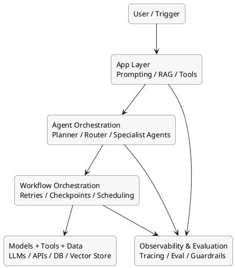

# AI 오케스트레이션 개요

## 한 줄 정의

AI 오케스트레이션은 여러 AI 모델, 에이전트, 도구, 데이터 소스, 워크플로 엔진을 연결해 복잡한 작업을 안정적으로 실행하도록 조정하는 계층이다.

## 왜 중요한가

단일 프롬프트 기반 애플리케이션은 빠르게 만들 수 있지만, 실제 업무 자동화는 보통 다음을 함께 요구한다.

- 여러 단계의 추론과 도구 호출
- 실패 복구와 재시도
- 장시간 실행과 상태 보존
- 사람 승인(HITL, human-in-the-loop)
- 로그, 추적, 평가, 비용 관리

즉, 좋은 모델만으로는 부족하고, "어떻게 연결하고 운영할 것인가"가 핵심이 된다.

## AI 오케스트레이션을 보는 5개 계층

1. 모델 계층: LLM, 멀티모달 모델, 임베딩 모델
2. 앱 계층: 프롬프트, 툴 호출, RAG, 메모리, 세션 관리
3. 에이전트 계층: 계획, 역할 분담, 라우팅, 멀티에이전트 협업
4. 워크플로 계층: 재시도, 체크포인트, 스케줄링, durable execution
5. 운영 계층: 추적, 평가, 가드레일, 보안, 비용/성능 모니터링

## 구조 다이어그램

## 대표 실행 패턴

### 1. Prompt Chaining

한 단계의 출력이 다음 단계 입력으로 이어지는 가장 단순한 패턴이다. 구현은 쉽지만 분기와 복구가 늘어나면 빠르게 복잡해진다.

### 2. Routing

입력 종류에 따라 적합한 모델이나 에이전트로 보내는 방식이다. 예: 고객 문의를 요약형, 검색형, 실행형 에이전트로 분기.

### 3. Parallelization

여러 하위 작업을 동시에 실행한 뒤 결과를 합친다. 조사, 후보안 생성, 문서 비교 작업에 유리하다.

### 4. Planner-Executor

계획을 세우는 에이전트와 실제 수행하는 에이전트를 분리한다. 장기 작업에 강하지만 상태 관리가 중요하다.

### 5. Planner-Critic / Reviewer

한 에이전트가 생성하고 다른 에이전트가 검토한다. 품질 향상에 도움되지만 비용과 지연 시간이 증가한다.

### 6. Human-in-the-loop

위험한 액션 전 사람 승인을 넣는 방식이다. 결제, 배포, 고객 응답 승인 같은 업무에 적합하다.

## 주요 기술 범주와 도구

| 범주 | 역할 | 대표 도구 |
| --- | --- | --- |
| Agent Orchestration | 상태 기반 에이전트 흐름, 멀티에이전트 협업 | LangGraph, CrewAI, AutoGen, Mastra |
| Workflow Orchestration | durable execution, 재시도, 장시간 작업 | Temporal, Airflow, Prefect |
| LLM App Orchestration | 모델 호출, 툴 연결, RAG 구성요소 | LangChain, LlamaIndex, Vercel AI SDK |
| Visual / Low-code | 빠른 자동화 프로토타이핑 | n8n, Zapier Agents |
| Observability / Evaluation | 추적, 평가, 실험 관리 | LangSmith, Arize Phoenix, Langfuse, DeepEval |

## 도구별 포지셔닝

### LangGraph

- 상태 기반 그래프 모델에 강함
- 복잡한 분기, 순환, 사람 승인, 체크포인트 처리에 적합
- 프로덕션형 에이전트 흐름 제어에 유리함

### CrewAI

- 역할 중심 멀티에이전트 설계가 직관적임
- "리서처-작성자-리뷰어" 같은 팀 구조를 빠르게 만들기 좋음
- 개념 전달과 프로토타이핑이 쉬움

### AutoGen

- 대화 중심 멀티에이전트 상호작용에 강함
- 연구, 코드 생성, 반복 협업 시나리오에 자주 쓰임
- 유연하지만 운영 표준화는 별도 설계가 필요함

### Temporal

- AI 자체 프레임워크라기보다 장기 실행 워크플로 엔진에 가까움
- 서버 재시작, 타임아웃, 대기 상태 복구 같은 운영 요구에 강함
- "에이전트 두뇌"보다 "실행 인프라"로 보는 편이 정확함

### Airflow / Prefect

- 데이터 파이프라인과 배치 워크플로 중심
- 학습/평가/배치 추론/문서 전처리 같은 백오피스 작업에 적합
- 실시간 에이전트 협업보다는 데이터 운영과 결합이 강점

### n8n

- 시각적 자동화에 강함
- SaaS 연동, 알림, 승인, CRM/문서 시스템 연결에 유리함
- 복잡한 추론보다 "업무 연결"에 더 적합함

## 실무에서 자주 보이는 아키텍처

### 패턴 A: 단일 앱 내부 오케스트레이션

- 예: 고객지원 챗봇
- 구성: 앱 서버 + LLM + 검색 + 로그
- 장점: 빠름, 단순함
- 한계: 장기 실행과 장애 복구가 약함

### 패턴 B: 에이전트 그래프 + 관측 도구

- 예: 사내 리서치/문서 작성 자동화
- 구성: LangGraph + 모델 + 벡터DB + LangSmith/Phoenix
- 장점: 분기와 상태 제어가 좋음
- 한계: 운영 내구성은 별도 설계 필요

### 패턴 C: 에이전트 + 워크플로 엔진 2계층

- 예: 승인 절차가 있는 장시간 업무 자동화
- 구성: LangGraph/CrewAI + Temporal/Prefect + 관측 도구
- 장점: 추론과 내구성을 분리 가능
- 한계: 설계 난도와 비용이 높음

## 핵심 트레이드오프

| 축 | 이점 | 비용 |
| --- | --- | --- |
| 자율성 증가 | 자동화 범위 확대 | 오류 통제, 가드레일 필요 |
| 멀티에이전트화 | 역할 분담, 품질 향상 | 디버깅 난도와 토큰 비용 증가 |
| 워크플로 내구성 강화 | 실패 복구, 장기 작업 가능 | 아키텍처 복잡도 증가 |
| 관측/평가 도입 | 품질 개선과 운영 안정성 확보 | 초기 계측 비용 발생 |
| 저코드 채택 | 빠른 도입 | 복잡한 제어 로직 한계 |

## 언제 무엇을 먼저 볼까

- 개념 이해가 목적이면: LangGraph, CrewAI, AutoGen 비교부터
- 운영 안정성이 중요하면: Temporal, Prefect 같이 durable execution 계층을 함께 검토
- 문서/RAG 중심이면: LangChain, LlamaIndex, 벡터DB 설계까지 포함해 검토
- 현업 자동화가 목적이면: n8n 같은 시각적 오케스트레이션도 함께 비교
- 품질 관리가 중요하면: LangSmith, Phoenix, DeepEval 같은 관측/평가 도구를 반드시 포함

## 조사하면서 볼 핵심 질문

1. 이 시스템은 "추론 오케스트레이션"이 필요한가, 아니면 "업무 워크플로 자동화"가 필요한가?
2. 실패했을 때 어디까지 복구해야 하는가?
3. 사람 승인 지점은 어디에 들어가야 하는가?
4. 상태는 메모리 수준인가, 장기 워크플로 수준인가?
5. 평가와 추적 없이도 운영 가능한가?

## 현재 관찰된 큰 흐름

- 단순 프롬프트 체인에서 상태 기반 에이전트 그래프로 이동 중
- "에이전트 프레임워크 + durable workflow 엔진" 조합이 증가 중
- 추적과 평가가 선택이 아니라 필수 운영 요소로 이동 중
- 저코드 도구와 개발자용 프레임워크의 경계가 점점 좁아지는 중

## 다음에 파고들 만한 주제

- LangGraph vs CrewAI vs AutoGen 비교
- AI 에이전트 시스템에서 Temporal을 붙이는 방식
- 관측/평가 스택(LangSmith, Phoenix, DeepEval) 비교
- 리서치 자동화, 고객지원, 내부 업무 자동화 사례별 아키텍처

## 3줄 요약

- AI 오케스트레이션은 모델, 앱, 에이전트, 워크플로, 운영 계층이 함께 맞물리는 구조로 이해하는 것이 가장 쉽다.
- 핵심 패턴은 chaining, routing, parallelization, planner, reviewer, HITL 같은 흐름 제어 방식이다.
- 도구 비교보다 먼저 어떤 문제를 어떤 계층에서 풀어야 하는지 구분하는 것이 중요하다.
