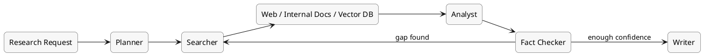
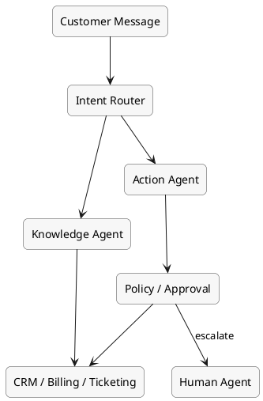
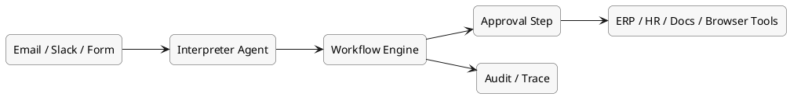

# AI 오케스트레이션 활용 사례

이 문서는 AI 오케스트레이션이 실제로 어떤 업무에서 가치가 큰지, 그리고 어떤 구조로 구현되는지 사례 중심으로 정리한 문서다.

## 먼저 큰 그림

AI 오케스트레이션이 특히 강한 영역은 "한 번 답하고 끝나는 작업"이 아니라, 여러 단계와 시스템을 거쳐 결과를 완성해야 하는 업무다. 여기서는 대표적으로 세 가지를 본다.

1. 리서치 자동화
2. 고객지원 자동화
3. 내부 업무 자동화

## 사례 1: 리서치 자동화

### 어떤 문제를 푸나

하나의 질문에 대해 자료를 찾고, 핵심을 추리고, 빠진 부분을 다시 조사하고, 최종 문서까지 만드는 작업이다.

예를 들면 다음과 같다.

- 특정 기술 주제 조사
- 경쟁사 동향 정리
- 시장/규제 변화 모니터링
- 문서 초안 작성과 근거 정리

### 왜 오케스트레이션이 필요한가

리서치는 보통 한 번의 검색으로 끝나지 않는다. 검색 -> 요약 -> 공백 확인 -> 재검색 -> 검증 -> 문서화가 반복된다. 그래서 반복 루프와 상태 관리가 중요하다.

### 흔한 구조

- 입력: 조사 질문 또는 브리프
- 에이전트: 검색 에이전트, 분석 에이전트, 검증 에이전트, 작성 에이전트
- 데이터: 웹 검색, 내부 문서, 벡터DB
- 운영: tracing, 인용 확인, 비용 관리

### 자주 쓰는 도구

- 에이전트 계층: `LangGraph`, `AutoGen`
- 검색/데이터 계층: 웹 검색 도구, RAG 스택, 벡터DB
- 운영 계층: `LangSmith`, `Phoenix`, `DeepEval`

### 주요 위험

- 근거 없는 내용을 그럴듯하게 연결하는 환각
- 에이전트끼리 잘못된 가정을 강화하는 자기확증 루프
- 자료 수집이 길어지면서 토큰 비용이 급증하는 문제
- 출처와 최신성 관리 실패

### 주요 평가 지표

- 근거 정확도: 주장 중 출처로 뒷받침되는 비율
- 커버리지: 사람이 기대한 핵심 주제를 얼마나 빠짐없이 다뤘는지
- 최신성: 최신 자료 반영 여부
- 비용 대비 산출물 품질

## 사례 2: 고객지원 자동화

### 어떤 문제를 푸나

고객 문의를 분류하고, 답변하고, 필요한 경우 실제 조치까지 수행하는 문제다.

예를 들면 다음과 같다.

- 주문 상태 확인
- 환불/교환 정책 안내
- 기술 문제 1차 해결
- 상담원에게 맥락을 보존한 핸드오프

### 왜 오케스트레이션이 필요한가

고객지원은 단순 질의응답이 아니라 분류, 정책 확인, 외부 시스템 조회, 실행, 사람 전환이 이어진다. 즉 대화와 업무 실행이 함께 존재한다.

### 흔한 구조

- 입력: 채팅, 이메일, 티켓
- 라우터: 문의 유형 분류
- 실행 계층: 주문 조회, 환불 요청, 계정 상태 확인 등 툴 호출
- 보호 장치: 민감 액션은 사람 승인 또는 정책 검사
- 핸드오프: 상담원에게 요약과 로그 전달

### 자주 쓰는 도구

- 앱/에이전트 계층: `LangGraph`, `CrewAI`, `Vercel AI SDK`
- 업무 시스템 계층: CRM, 티켓 시스템, 주문/결제 API
- 운영 계층: tracing, policy audit, 품질 평가 도구

### 주요 위험

- 맞는 툴을 잘못된 인자로 호출하는 실행 오류
- 고객 데이터 과다 노출
- 정책 위반 답변 또는 승인 없는 액션 실행
- 대화 문맥 손실로 인한 고객 경험 저하

### 주요 평가 지표

- 무인 해결률
- 첫 응답 시간 / 평균 해결 시간
- 정책 준수율
- 고객 만족도
- 사람 전환 시 전달 품질

## 사례 3: 내부 업무 자동화

### 어떤 문제를 푸나

사내 승인, 문서 처리, 데이터 정리, 시스템 간 전달처럼 사람이 반복적으로 이어 붙이던 업무를 자동화하는 문제다.

예를 들면 다음과 같다.

- 인보이스 처리
- 구매 요청 승인 흐름
- 이메일/슬랙 기반 업무 접수
- 문서 분류와 ERP/CRM 반영

### 왜 오케스트레이션이 필요한가

내부 업무는 규칙 기반처럼 보이지만 실제로는 예외가 많고, 여러 시스템에 걸쳐 있고, 사람 승인도 필요하다. 그래서 단순 RPA보다 더 유연한 판단과 흐름 제어가 필요하다.

### 흔한 구조

- 이벤트 트리거: 이메일, 슬랙, 폼, DB 변경
- 에이전트: 요청 해석, 데이터 추출, 분류, 후속 작업 결정
- 실행 인프라: 장기 대기, 승인, 재시도, 스케줄링
- 시스템 연결: ERP, HR, 회계, 문서 관리, 브라우저 자동화

### 자주 쓰는 도구

- 에이전트 계층: `CrewAI`, `LangGraph`
- 워크플로 계층: `Temporal`, `Prefect`, `n8n`
- 업무 시스템 계층: ERP, HRIS, 문서 시스템, 메일/메신저 도구

### 주요 위험

- 잘못된 자동 승인
- 메일/메신저 루프 같은 무한 반복
- 시스템 간 데이터 불일치
- 느린 처리 속도로 인한 현업 불신

### 주요 평가 지표

- 업무 처리 시간 단축률
- 사람 개입률
- 자동화 성공률
- 오류 재처리율
- ROI 또는 절감된 인력 시간

## 세 사례를 나란히 보면

| 사례 | 오케스트레이션 핵심 | 자주 쓰는 패턴 | 특히 중요한 운영 요소 |
| --- | --- | --- | --- |
| 리서치 자동화 | 반복 조사와 검증 루프 | planner-reviewer, search loop | 인용 근거, 최신성, 비용 통제 |
| 고객지원 자동화 | 라우팅과 정책 기반 실행 | router-executor, HITL | 권한 통제, 핸드오프, 정책 준수 |
| 내부 업무 자동화 | 장기 실행과 시스템 연결 | event-driven, approval flow | durable execution, 감사 로그 |

## 어떤 사례가 가장 먼저 도입하기 좋은가

- 리서치 자동화: 내부 지식작업 보조로 시작하기 쉬움
- 고객지원 자동화: ROI가 명확하지만 정책/보안 설계가 더 중요함
- 내부 업무 자동화: 비용 절감 효과가 크지만 시스템 연동 난도가 높음

보통은 "위험이 낮고 결과를 검토하기 쉬운 업무"부터 시작하는 편이 좋다. 그래서 초반에는 리서치 보조나 내부 문서 처리 자동화가 자주 선택된다.

## 공통적으로 필요한 것

세 사례 모두에서 공통적으로 필요한 것은 비슷하다.

- 상태 저장
- 재시도와 복구
- 사람 승인 지점
- 추적과 평가
- 비용/지연시간 관리
- 툴 권한과 보안 통제

## 결론

AI 오케스트레이션의 가치는 "답변 생성"보다 "업무 완료율"에서 더 크게 드러난다. 특히 여러 시스템과 단계가 얽힌 순간부터, 오케스트레이션은 선택이 아니라 핵심 설계 문제가 된다.

## 다음에 파고들 수 있는 주제

- `05-durable-execution.md`: 왜 `Temporal` 같은 계층이 필요한가
- `06-observability-evaluation.md`: tracing, evaluation, guardrails를 어떻게 붙일 것인가

## 3줄 요약

- 오케스트레이션의 가치는 리서치, 고객지원, 내부 업무 자동화처럼 여러 단계와 시스템이 얽힌 업무에서 크게 드러난다.
- 사례마다 구조는 달라도 공통적으로 상태 저장, 복구, 승인, 추적, 보안이 필요하다.
- 초기 도입은 위험이 낮고 결과 검토가 쉬운 업무부터 시작하는 편이 유리하다.
