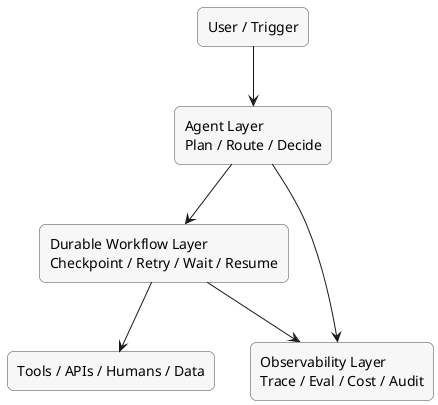

# AI 오케스트레이션에서 Durable Execution

이 문서는 왜 에이전트 프레임워크만으로는 운영 환경에서 부족할 수 있는지, 그리고 durable execution이 왜 중요한지 설명하는 문서다.

## 먼저 한 문장으로

durable execution은 오래 걸리는 AI 워크플로가 중간 장애, 배포, 타임아웃, 사람 승인 대기 상황을 만나도 상태를 잃지 않고 다시 이어서 실행되게 만드는 실행 계층이다.

## 왜 이 문서가 따로 필요한가

초기 데모에서는 에이전트가 검색하고 답하고 끝나면 충분해 보인다. 하지만 실제 업무에서는 다음 같은 상황이 바로 등장한다.

- 작업이 몇 분, 몇 시간, 며칠에 걸쳐 이어짐
- 외부 API 실패와 네트워크 불안정이 자주 발생함
- 중간에 사람 승인을 기다려야 함
- 서버 재시작이나 배포가 있어도 작업이 사라지면 안 됨
- 같은 작업을 처음부터 다시 돌리면 비용이 크게 증가함

즉, 문제는 "에이전트가 생각을 잘하느냐"만이 아니라 "실행을 잃지 않느냐"로 바뀐다.

## 에이전트 프레임워크만으로 부족해지는 지점

`LangGraph`, `CrewAI`, `AutoGen` 같은 도구는 추론 흐름과 역할 분담에는 강하다. 하지만 운영 환경에서는 다음이 별도 문제로 등장한다.

- 장기 실행 상태를 어디에 저장할 것인가
- 실패한 단계만 안전하게 재시도할 수 있는가
- 사람 승인까지 몇 시간이나 며칠을 기다릴 수 있는가
- 프로세스가 죽어도 같은 지점에서 재개할 수 있는가
- 중복 실행과 사이드이펙트를 어떻게 통제할 것인가

그래서 실무에서는 "에이전트 두뇌"와 "실행 내구성"을 분리하는 구조가 자주 등장한다.

## durable execution의 핵심 개념

### 체크포인트

작업 상태를 중간중간 저장해, 실패 후에도 처음부터 다시 하지 않도록 만드는 개념이다. AI 워크플로에서는 특히 긴 리서치, 문서 처리, 승인 대기 흐름에서 중요하다.

### 재시도

실패한 작업을 정책에 따라 다시 시도하는 기능이다. 단순 재시도만이 아니라 지수 백오프, 최대 횟수, 실패 유형별 대응이 중요해진다.

### resume after failure

프로세스나 서버가 중단돼도 마지막 안정 지점에서 다시 이어서 실행하는 능력이다. durable execution의 핵심 가치가 여기에 있다.

### human approval wait

사람 승인이 필요할 때 워크플로를 멈춘 채로 안전하게 기다리고, 승인 후 이어서 진행하는 능력이다. 결제, 환불, 배포, 계약, 민감한 고객 응답에 자주 필요하다.

### orchestration boundary

어디까지를 에이전트가 담당하고, 어디서부터 워크플로 엔진이 책임질지를 나누는 경계다. 이 경계를 명확히 해야 설계가 단순해진다.

## 구조를 가장 쉽게 보면

### 1. 에이전트 계층

무엇을 할지 결정하고, 어떤 도구를 호출할지 판단하는 계층이다.

### 2. 워크플로 계층

그 결정을 실제로 안정적으로 실행하고, 실패와 대기와 복구를 관리하는 계층이다.

### 3. 운영 계층

어디서 느려졌고 왜 실패했는지 보고, 비용과 성공률을 측정하는 계층이다.

## 실무에서 자주 보이는 패턴

### 패턴 A: 에이전트 내부에서만 처리

- 장점: 빠르고 단순함
- 한계: 장애 복구와 장기 실행이 약함
- 적합: 짧은 세션형 작업, 프로토타입

### 패턴 B: 에이전트 + durable workflow 2계층

- 장점: 추론과 실행 안정성을 분리 가능
- 한계: 설계 난도가 올라감
- 적합: 승인, 재시도, 멀티스텝 업무 자동화

### 패턴 C: 데이터 워크플로 + 에이전트 혼합

- 장점: 배치 데이터 처리와 AI 판단을 함께 설계 가능
- 한계: 실시간 상호작용에는 추가 설계가 필요함
- 적합: 문서 파이프라인, 평가 파이프라인, 정기 리포트 생성

## 도구는 어디에 맞는가

### Temporal

- 가장 대표적인 durable workflow 엔진으로 자주 거론됨
- 긴 실행 시간, 외부 신호, 승인 대기, 실패 후 재개에 강함
- "AI 프레임워크"라기보다 "실행 내구성 인프라"에 가깝다
- 에이전트 프레임워크 위에 붙여 운영 계층을 강화하는 용도에 잘 맞음

### Prefect

- Python 중심 워크플로와 가시성이 강점
- 데이터 파이프라인과 AI 파이프라인을 함께 다루기 좋음
- 동적 흐름과 운영 관찰이 비교적 자연스러움
- 데이터 준비, 평가, 배치 처리, 내부 자동화에 잘 맞음

### Airflow

- 스케줄 기반 DAG와 배치 작업에 강함
- 전통적인 데이터 워크플로와 궁합이 좋음
- 대화형 승인 대기나 세밀한 상호작용에는 상대적으로 덜 자연스러움
- 정기 학습, 배치 추론, ETL 중심 환경에 적합함

## 왜 단순 큐나 크론으로는 부족한가

처음에는 큐, 배치 스크립트, 크론 조합으로도 돌아가는 것처럼 보인다. 하지만 작업이 길어지고 예외가 늘어나면 다음 문제가 생긴다.

- 어디까지 진행됐는지 알기 어려움
- 중복 실행으로 외부 시스템에 잘못된 액션이 발생함
- 재시도 정책이 제각각이라 운영이 불안정해짐
- 사람 승인 같은 비동기 이벤트를 우아하게 다루기 어려움
- 실패 분석이 로그 읽기 수준에 머무름

## 핵심 트레이드오프

| 축 | durable execution을 도입했을 때 얻는 것 | 대신 생기는 비용 |
| --- | --- | --- |
| 신뢰성 | 장애 후 재개, 상태 보존 | 설계 복잡도 증가 |
| 운영성 | 재시도/대기/복구를 표준화 가능 | 러닝 커브 증가 |
| 비용 효율 | 처음부터 재실행하지 않아 토큰 낭비 감소 | 인프라/운영 비용 증가 |
| 제어력 | 승인, 신호, 외부 이벤트 처리 가능 | 추상화가 늘어 개발 속도 저하 가능 |

## 언제 꼭 검토해야 하나

- 몇 분 이상 걸리는 AI 작업이 있다
- 작업 중간에 사람 승인이 필요하다
- 외부 API 실패가 잦다
- 중간 결과를 잃으면 비용이 크다
- 같은 작업을 정확히 이어서 재개해야 한다

이 중 둘 이상이 해당되면 durable execution 계층을 적극적으로 검토하는 편이 좋다.

## 설계할 때 가장 중요한 질문

1. 어느 단계를 재시도해도 안전한가?
2. 어떤 단계는 반드시 한 번만 실행돼야 하는가?
3. 상태는 메모리, DB, 워크플로 히스토리 중 어디에 남길 것인가?
4. 사람 승인이나 외부 이벤트는 어떤 신호로 연결할 것인가?
5. 실패했을 때 사용자에게 어떤 진행 상태를 보여줄 것인가?

## 결론

AI 오케스트레이션이 실제 업무로 들어가면, 추론의 문제는 곧 실행 신뢰성의 문제로 확장된다. durable execution은 그 순간부터 부가 기능이 아니라 핵심 인프라가 된다.

## 다음 문서로 넘어가기

이제 `06-observability-evaluation.md`에서 tracing, evaluation, guardrails를 어떻게 붙여야 운영 품질을 확보할 수 있는지 이어서 볼 수 있다.

## 3줄 요약

- durable execution은 긴 AI 작업이 실패, 대기, 배포, 재시작 상황에서도 상태를 잃지 않게 만드는 실행 계층이다.
- 에이전트 프레임워크는 추론에 강하지만, 장기 실행 복구와 승인 대기는 별도 계층이 필요한 경우가 많다.
- `Temporal`, `Prefect`, `Airflow`는 서로 다른 방식으로 이 실행 내구성 문제를 다룬다.
