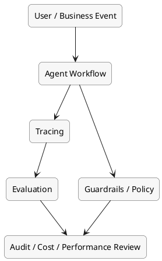

# AI 오케스트레이션의 Observability와 Evaluation

이 문서는 AI 오케스트레이션 시스템을 실제로 운영할 때 왜 tracing, evaluation, guardrails가 필수인지 정리한 문서다.

## 먼저 한 문장으로

observability와 evaluation은 에이전트가 무엇을 했는지 보게 해주고, 그 결과가 실제로 잘된 것인지 판단하게 해주는 운영 품질 계층이다.

## 왜 이 계층이 따로 필요한가

AI 시스템은 겉으로는 그럴듯하게 성공해 보이지만 실제로는 틀린 경우가 많다. 특히 에이전트 시스템은 여러 단계와 도구 호출이 얽혀 있어서 실패가 더 조용하게 숨어든다.

예를 들면 이런 상황이 생긴다.

- 답변은 매끈하지만 사실은 틀림
- 맞는 도구를 엉뚱한 인자로 호출함
- 같은 도구를 반복 호출하며 비용만 증가시킴
- 정책 위반 내용을 생성하거나 민감정보를 노출함
- 사용자 불만이 생긴 뒤에야 문제를 인지함

그래서 "실행 로그가 있다"와 "운영이 보인다"는 전혀 다른 문제다.

## 이 문서에서 보는 4가지 층

1. tracing: 에이전트가 어떤 경로로 실행됐는지 보기
2. evaluation: 그 결과가 실제로 좋은지 판단하기
3. guardrails: 위험한 입력/출력/행동을 막기
4. policy / audit: 조직 기준과 규정을 지켰는지 확인하기

## 1. Tracing

tracing은 에이전트의 실행 경로를 시간 순서대로 재구성하는 일이다. 전통적인 APM보다 더 깊게 들어가야 한다.

### tracing에서 보고 싶은 것

- 어떤 사용자 입력에서 실행이 시작됐는가
- 어떤 모델 호출이 있었는가
- 어떤 툴을 어떤 순서로 호출했는가
- 어떤 분기와 재시도가 발생했는가
- 어느 단계에서 비용과 지연시간이 커졌는가

### 왜 중요한가

에이전트 실패는 한 번의 예외로 끝나지 않는다. reasoning, tool call, retrieval, policy, handoff 중 어디가 문제였는지 봐야 root cause를 찾을 수 있다.

### 대표 도구

- `LangSmith`: LangChain/LangGraph 생태계와 깊게 연결됨
- `Phoenix`: OpenTelemetry 친화적인 관측 스택
- `Langfuse`: 프레임워크 중립적이고 self-hosting 선택지가 강점

## 2. Evaluation

evaluation은 단순히 "출력이 있었는가"가 아니라 "그 출력이 실제로 잘됐는가"를 보는 일이다.

### 왜 일반 QA보다 어려운가

에이전트는 여러 단계를 거치므로, 중간 단계는 맞았는데 최종 결과는 틀릴 수 있다. 반대로 중간 단계 일부가 거칠어도 최종 업무는 성공할 수 있다. 그래서 입력-출력만 보는 평가는 충분하지 않다.

### 자주 보는 평가 관점

- task completion: 사용자의 목표를 실제로 달성했는가
- tool correctness: 올바른 도구와 인자를 사용했는가
- faithfulness / grounding: 근거 기반으로 답했는가
- step efficiency: 불필요한 단계가 많지 않았는가
- policy compliance: 허용된 범위 안에서 행동했는가

### 평가 방식

- 기준 데이터셋 기반 평가
- LLM-as-a-judge
- 사람 검토 기반 샘플 평가
- 온라인 운영 데이터 기반 회귀 테스트

### 대표 도구

- `DeepEval`: 에이전트와 LLM 평가 지표를 체계화하기 좋음
- `LangSmith`: tracing과 eval을 함께 엮기 좋음
- `Phoenix`: 관측과 평가 흐름을 함께 가져가기 좋음

## 3. Guardrails

guardrails는 잘못된 출력을 나중에 발견하는 것이 아니라, 위험한 행동을 실행 전에 막는 층이다.

### guardrails가 다루는 것

- 프롬프트 인젝션 방어
- PII나 민감정보 노출 방지
- 금지 주제 차단
- 위험한 툴 사용 제한
- 정책 위반 액션 실행 차단

### 왜 중요한가

에이전트는 단순 답변 생성보다 위험하다. 실제 시스템을 호출하고 고객 데이터에 접근하고 액션을 실행할 수 있기 때문이다. 그래서 출력 품질만 보는 것으로는 부족하다.

## 4. Policy와 Audit

정책과 감사는 "무엇이 기술적으로 가능하냐"가 아니라 "무엇이 조직적으로 허용되느냐"를 다루는 층이다.

### 여기서 다뤄야 하는 것

- 어떤 툴을 어떤 권한으로 쓸 수 있는가
- 어떤 상황에서 사람 승인으로 넘어가야 하는가
- 어떤 로그를 남겨야 하는가
- 규제 산업에서 어떤 설명 가능성이 필요한가

이 층이 없으면 에이전트는 동작하더라도 조직 안에서는 신뢰받기 어렵다.

## 스택을 한 그림으로 보면

## 도구는 어디에 맞는가

| 도구 | 주된 역할 | 잘 맞는 경우 |
| --- | --- | --- |
| `LangSmith` | tracing + eval | LangChain/LangGraph 기반 시스템 |
| `Phoenix` | OTel 기반 observability | 개방형 표준과 self-hosted 관측을 선호할 때 |
| `Langfuse` | 프레임워크 중립 tracing/metrics | 다양한 스택을 함께 추적할 때 |
| `DeepEval` | 평가 프레임워크 | CI/CD나 실험에서 품질 기준을 명확히 둘 때 |

## 2026년 기준으로 특히 중요해진 지표

- task completion rate
- tool call correctness
- latency per run
- token / cost per successful task
- human handoff rate
- hallucination or grounding failure rate
- policy violation rate

핵심은 단순 응답 정확도보다 "업무 완료율"과 "실패 방식"을 함께 보는 것이다.

## 실무에서 자주 하는 실수

### tracing 없이 eval만 봄

결과가 나쁘다는 건 알 수 있지만 왜 그런지 알 수 없다.

### eval 없이 tracing만 봄

실행 경로는 잘 보이지만, 실제로 잘된 실행인지 판단 기준이 없다.

### 운영 전에는 guardrails를 미룸

나중에 붙이려 하면 정책 위반 흐름이 이미 제품 안에 퍼져버린다.

### 비용 관측을 늦게 붙임

runaway agent나 반복 툴 호출을 늦게 발견해 비용이 폭증할 수 있다.

### 사람 검토를 완전히 제거하려 함

초기에는 사람 검토가 품질 기준을 만드는 데 오히려 도움이 된다.

## 어떻게 읽어야 하나

이 문서를 볼 때는 "무슨 도구가 좋은가"보다 먼저 아래를 생각하는 게 좋다.

1. 무엇을 성공으로 볼 것인가?
2. 무엇을 실패로 볼 것인가?
3. 실패 원인을 어디까지 추적할 것인가?
4. 어떤 행동은 아예 막아야 하는가?
5. 어떤 지표가 비용과 품질을 함께 설명하는가?

## 결론

AI 오케스트레이션의 마지막 문제는 보통 성능이 아니라 신뢰다. observability, evaluation, guardrails는 그 신뢰를 운영 가능한 형태로 바꾸는 핵심 계층이다.

## 다음에 이어서 볼 만한 주제

- `07-design-patterns.md`: planner, router, reviewer, HITL 패턴을 어떻게 조합할 것인가
- `08-tooling-map.md`: 도구들을 계층별로 어떻게 함께 볼 것인가
- `09-implementation-recipes.md`: 실제 조합 템플릿은 어떻게 잡을 것인가

## 3줄 요약

- tracing은 무엇이 일어났는지 보여주고, evaluation은 그것이 실제로 잘됐는지 판단하게 해준다.
- guardrails와 policy/audit은 위험한 행동을 막고 조직 기준을 적용하는 운영 안전장치다.
- AI 에이전트 운영에서 신뢰를 만들려면 관측, 평가, 비용 관리가 처음부터 함께 설계돼야 한다.
