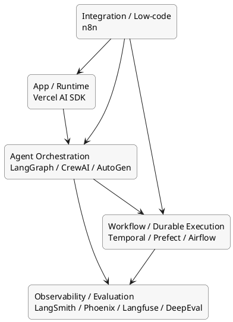

# AI 오케스트레이션 툴링 맵

이 문서는 AI 오케스트레이션 관련 도구를 한 장의 계층도로 이해하기 쉽게 정리한 문서다.

## 먼저 한 문장으로

오케스트레이션 도구들은 대부분 경쟁 제품이라기보다, 서로 다른 계층을 맡는 보완 관계로 보는 편이 정확하다.

## 왜 툴링 맵이 필요한가

초보자 입장에서는 `LangGraph`, `CrewAI`, `Temporal`, `LangSmith`, `n8n` 같은 이름이 한꺼번에 나오면 모두 비슷한 종류처럼 보이기 쉽다. 하지만 실제로는 질문이 다르다.

- 누가 추론 흐름을 짜는가?
- 누가 장기 실행과 복구를 맡는가?
- 누가 추적과 평가를 맡는가?
- 누가 외부 시스템 연결을 쉽게 해주는가?

이 차이를 한 번에 보기 위해 툴링 맵이 필요하다.

## 크게 5개 계층으로 보면 쉽다

1. 앱 / 런타임 계층
2. 에이전트 오케스트레이션 계층
3. 워크플로 / durable execution 계층
4. 관측 / 평가 계층
5. 통합 / 저코드 계층

## 1. 앱 / 런타임 계층

### 대표 도구

- `Vercel AI SDK`

### 역할

- 사용자 인터페이스와 모델 호출을 연결함
- 스트리밍 응답, 앱 통합, 런타임 경험을 다룸

### 이렇게 보면 된다

앱 계층은 사용자가 실제로 만나는 진입점에 가깝다. 에이전트 설계 자체보다는 제품 안에 AI 기능을 녹여 넣는 역할이 강하다.

## 2. 에이전트 오케스트레이션 계층

### 대표 도구

- `LangGraph`
- `CrewAI`
- `AutoGen`

### 역할

- 에이전트 흐름 설계
- 역할 분담과 분기 제어
- 멀티에이전트 협업 관리

### 차이를 아주 짧게 보면

- `LangGraph`: 상태와 분기 제어
- `CrewAI`: 역할 기반 팀 구성
- `AutoGen`: 대화 기반 상호작용

## 3. 워크플로 / durable execution 계층

### 대표 도구

- `Temporal`
- `Prefect`
- `Airflow`

### 역할

- 장기 실행과 복구
- 재시도, 체크포인트, 승인 대기
- 스케줄링과 배치 운영

### 이렇게 보면 된다

이 계층은 에이전트가 무엇을 할지 정하는 것이 아니라, 그 결정을 실제 운영 환경에서 잃지 않고 끝까지 실행하게 만드는 쪽에 가깝다.

## 4. 관측 / 평가 계층

### 대표 도구

- `LangSmith`
- `Phoenix`
- `Langfuse`
- `DeepEval`

### 역할

- tracing
- evaluation
- 비용 / 지연시간 관측
- 품질 회귀 감지

### 이렇게 보면 된다

이 계층은 "무엇이 일어났는가"와 "그게 실제로 잘된 것인가"를 동시에 보게 해준다. 운영 신뢰성은 이 계층 없이는 완성되기 어렵다.

## 5. 통합 / 저코드 계층

### 대표 도구

- `n8n`

### 역할

- SaaS, API, 내부 시스템 연결
- 이벤트 기반 자동화 흐름 구성
- 비개발자/실무자와 함께 보는 시각적 워크플로 표현

### 이렇게 보면 된다

복잡한 추론 자체보다는 "업무 연결"과 "자동화 배선"에 강한 계층이다.

## 도구들은 어떻게 같이 붙는가

### 조합 A: 제품형 AI 기능

- 앱 계층: `Vercel AI SDK`
- 에이전트 계층: `LangGraph`
- 관측 계층: `LangSmith`

### 조합 B: 장기 실행형 내부 자동화

- 에이전트 계층: `CrewAI` 또는 `LangGraph`
- 워크플로 계층: `Temporal` 또는 `Prefect`
- 관측 계층: `Phoenix` 또는 `Langfuse`
- 통합 계층: `n8n`

### 조합 C: 데이터/배치 중심 파이프라인

- 워크플로 계층: `Airflow` 또는 `Prefect`
- 평가 계층: `DeepEval`
- 필요 시 에이전트 계층 일부 결합

## 비교할 때 보면 좋은 축

| 축 | 질문 |
| --- | --- |
| 역할 | 이 도구는 추론, 실행, 관측, 통합 중 무엇을 맡는가? |
| 제어력 | 세밀한 흐름 제어가 쉬운가? |
| 운영성 | 장기 실행, 복구, 관측이 쉬운가? |
| 도입 난도 | 코드 중심인가, 시각적 구성인가? |
| 생태계 적합성 | 현재 스택과 잘 붙는가? |

## 흔한 오해

### "이 도구들이 서로 완전히 대체 가능하다"

아니다. `LangGraph`와 `Temporal`은 경쟁보다는 계층이 다른 경우가 많다.

### "관측 도구는 나중에 붙이면 된다"

실무에서는 초반부터 붙여야 비용, 품질, 실패 원인을 볼 수 있다.

### "저코드 도구는 단순하고 개발자 도구는 고급이다"

항상 그렇지 않다. `n8n`은 복잡한 업무 연결에 매우 강할 수 있고, 개발자 도구와 함께 쓰면 오히려 실무성이 커진다.

## 아주 거칠게 선택하면

- 앱에 AI를 넣고 싶다 -> `Vercel AI SDK`
- 에이전트 흐름을 정교하게 짜고 싶다 -> `LangGraph`
- 역할 기반 멀티에이전트를 빨리 만들고 싶다 -> `CrewAI`
- 대화형 멀티에이전트를 실험하고 싶다 -> `AutoGen`
- 장기 실행과 복구가 중요하다 -> `Temporal`, `Prefect`, `Airflow`
- tracing과 eval이 필요하다 -> `LangSmith`, `Phoenix`, `Langfuse`, `DeepEval`
- SaaS와 내부 시스템 연결을 빠르게 하고 싶다 -> `n8n`

## 결론

툴링 맵의 핵심은 "무엇이 최고인가"를 묻는 것이 아니라, "내 문제를 풀기 위해 어떤 계층의 도구를 조합해야 하는가"를 보는 데 있다.

## 다음에 확장할 수 있는 주제

- `09-implementation-recipes.md`: 시나리오별 기본 조합 템플릿
- `10-glossary.md`: 용어를 짧게 다시 확인하는 참고 문서
- self-hosted 선호 조직을 위한 도구 선택 가이드

## 3줄 요약

- AI 오케스트레이션 도구는 앱, 에이전트, 워크플로, 관측, 통합 계층으로 나눠 보면 가장 이해하기 쉽다.
- 많은 도구는 서로 직접 경쟁하기보다 다른 계층을 맡는 보완 관계에 가깝다.
- 도구 선택은 단일 제품 비교보다 계층 조합 관점에서 보는 것이 실무적으로 더 정확하다.
