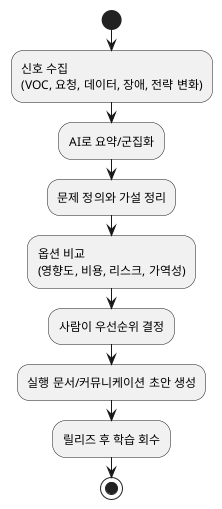

# AI 시대 플랫폼 기획자 업무 방식 연구 개요

## 목적

AI 시대의 플랫폼 기획자(Platform Planner / PM)가 더 빠르고 정확하게 일하기 위한 운영 방식, 의사결정 기준, 반복 업무 구조화를 연구 관점에서 정리한다.

## 핵심 질문

- AI는 플랫폼 기획자의 어떤 업무를 가장 크게 압축하는가?
- 사람의 판단이 끝까지 남아야 하는 영역은 무엇인가?
- 효율적인 팀은 어떤 운영 리듬과 문서 체계를 갖추는가?
- 도입 과정에서 어떤 리스크와 거버넌스 이슈가 생기는가?

## 핵심 용어

- 플랫폼 기획자: 여러 팀이 함께 쓰는 공통 기능, 내부 플랫폼, 운영 체계를 설계하고 우선순위를 조정하는 역할
- 운영 cadence: 일간, 주간, 월간, 분기 단위로 반복되는 운영 리듬
- 인접 증거: 플랫폼 기획 효율을 직접 측정하진 않지만, 협업/운영/내부 플랫폼 효율을 통해 메커니즘을 보여주는 근거
- 직접 증거: 문제 정의, 우선순위, 의사결정 리드타임처럼 플랫폼 기획 업무 자체의 전후 변화를 보여주는 근거

## 현재 전체 결론

- AI는 조사, 요약, 비교, 초안 작성, 패턴 추출처럼 텍스트 중심의 반복 업무에서 높은 효율을 만든다.
- 플랫폼 기획자의 핵심 가치는 문제 정의, 우선순위 결정, 이해관계자 정렬, 리스크 판단, 조직 설계 관점의 의사결정에 남는다.
- 가장 효율적인 방식은 "AI가 초안을 만들고 사람이 구조와 판단을 보정하는 운영 모델"이다.
- 좋은 팀은 산출물 수보다 의사결정 속도, 정확도, 재사용 가능한 템플릿 축적 여부를 성과 기준으로 본다.
- Agentic AI에 대한 관심은 커지지만, 현재 실무에서 현실적인 형태는 완전 자율보다 보조와 부분 자동화 중심이다.
- 국내 공개 사례를 보면, 플랫폼 기획 효율은 직접 수치보다 협업 플랫폼, 운영 플랫폼, 내부 자동화 사례를 통해 간접적으로 더 많이 관찰된다.

## 주장 관리표

- `observed`: AI는 조사, 요약, 비교, 초안 작성, 검색처럼 텍스트 중심 반복 업무를 압축한다.
- `observed`: 좋은 운영 모델은 공통 플랫폼, 템플릿, 결정 로그, 인간 승인 구조를 함께 가진다.
- `inference`: 국내 공개 사례는 협업 효율, 운영 효율, 내부 플랫폼 생산성 개선을 통해 기획 효율의 메커니즘을 간접적으로 보여준다.
- `hypothesis`: 국내 플랫폼 기획자는 초안 작성보다 회의 입력 압축과 이해관계자 메시지 정렬에서 더 큰 체감 효율을 얻을 가능성이 높다.
- `open question`: 플랫폼 PM의 문제 정의, 우선순위, 로드맵 작성 리드타임이 실제로 얼마나 개선되는지 직접 수치가 있는가?

## 효율 측정 지표

| 지표 | 정의 | 기준선 | 목표 | 책임자 | 검토 시점 |
| --- | --- | --- | --- | --- | --- |
| intake-to-triage time | 요청 접수부터 1차 분류 완료까지 걸리는 시간 | 측정 시작 필요 | 팀별 설정 | 플랫폼 기획 리드 | 주간 |
| meeting-to-decision time | 핵심 회의 종료부터 결정 로그 확정까지 걸리는 시간 | 측정 시작 필요 | 팀별 설정 | 의사결정 owner | 주간 |
| draft-to-approved memo time | 초안 작성부터 승인 가능한 메모 확정까지 걸리는 시간 | 측정 시작 필요 | 팀별 설정 | 문서 owner | 월간 |
| decision reopen rate | 이미 내린 결정을 재오픈하는 비율 | 측정 시작 필요 | 낮출 것 | 팀 리드 | 월간 |
| template reuse rate | 반복 업무 중 템플릿을 재사용한 비율 | 측정 시작 필요 | 높일 것 | 운영 owner | 월간 |

## 문서 구성

1. `00_개요.md` - 연구 범위, 핵심 결론, 문서 간 정합성 관리
2. `01_문제정의와핵심변화.md` - 문제 정의, 역할 변화, 운영 루프의 배경
3. `02_업무운영플레이북.md` - 실무 단계별 활용 방식과 운영 cadence
4. `03_의사결정프레임워크.md` - 우선순위 기준, AI 사용 경계, 리스크
5. `04_참고자료와추가조사.md` - 외부 신호, 공통 메시지, 후속 조사 주제
6. `05_국내사례조사.md` - 국내 조직 기준으로 확인할 사례 유형, 질문, 기록 템플릿
7. `06_AI프롬프트모음.md` - 반복 업무를 줄이기 위한 실전 프롬프트 세트
8. `07_운영템플릿.md` - 주간, 월간, 분기 운영에 바로 쓰는 실행 템플릿
9. `08_국내사례원문발췌.md` - 국내 사례에서 반복 인용 가능한 원문 근거 모음
10. `09_운영템플릿샘플.md` - 주간/월간 운영 문서를 실제로 채운 예시
11. `10_직접증거후보추가조사.md` - 직접 증거에 가까운 국내 후보와 검증 우선순위

## 읽기 가이드

- 전체 방향을 먼저 보려면 `00_개요.md` -> `01_문제정의와핵심변화.md` -> `03_의사결정프레임워크.md` 순서로 읽는다.
- 실제 실무 적용을 보려면 `02_업무운영플레이북.md` -> `06_AI프롬프트모음.md` -> `07_운영템플릿.md` 순서로 읽는다.
- 국내 맥락과 증거 수준을 보려면 `04_참고자료와추가조사.md` -> `05_국내사례조사.md` 순서로 읽는다.

## 연구 범위

- 대상: 플랫폼 기획자, 플랫폼 PM, 공통 기능/내부 플랫폼을 설계하는 조직
- 초점: 개인 생산성보다 팀 단위 의사결정 생산성 향상
- 제외: 특정 AI 툴의 상세 사용법, 모델 구현 기술, 엔지니어링 아키텍처 심화

## 공통 운영 모델

## 문서 정합성 체크

### `01_문제정의와핵심변화.md`

- 현재 요지: 플랫폼 기획자의 역할은 산출물 생산보다 신호 구조화와 문제 정의로 이동한다.
- 이번 반영: 기존 개요 문서의 목적, 핵심 변화, 운영 루프를 문제 정의 문서로 재배치했다.
- 미해결: 국내 플랫폼 조직 맥락에서 역할 구분이 어떻게 다른지 사례 보강이 필요하다.

### `02_업무운영플레이북.md`

- 현재 요지: AI는 신호 수집, 문제 정의, 옵션 설계, 커뮤니케이션, 회고 단계에서 가장 큰 효율을 만든다.
- 이번 반영: 일간/주간/월간/분기 운영 리듬을 유지하되, overview의 결론과 표현을 맞췄다.
- 미해결: 팀 규모별 운영 방식 차이를 추가 검증할 필요가 있다.

### `03_의사결정프레임워크.md`

- 현재 요지: AI는 발산과 압축에 강하고, 사람은 우선순위와 책임 판단을 맡아야 한다.
- 이번 반영: overview의 핵심 결론과 같은 언어로 평가 기준과 리스크를 정렬했다.
- 미해결: 실제 조직에서 쓰는 scoring 예시를 추가하면 활용도가 더 높아진다.

### `04_참고자료와추가조사.md`

- 현재 요지: 외부 자료들은 공통적으로 AI를 판단 대체재가 아니라 의사결정 가속 도구로 본다.
- 이번 반영: 자료 성격과 해석 수준을 overview와 동일한 톤으로 정리했다.
- 미해결: 해외 블로그성 자료 외에 국내 사례와 정량 자료를 추가 수집해야 한다.

### `05_국내사례조사.md`

- 현재 요지: 국내 맥락에서는 회의 압축, 메시지 정렬, 보안 승인 체계가 AI 활용 효율을 크게 좌우할 가능성이 높고, 공개 사례는 주로 인접 운영 효율 형태로 관찰된다.
- 이번 반영: 사례 요약표, 워크플로우 단계 매핑, `관찰된 사실 / 수치 또는 근거 / 기획자에게 왜 중요할 수 있는가 / 무엇을 아직 증명하지 못하는가 / 전이 가능성` 구조로 재정리했다.
- 미해결: 플랫폼 PM의 문제 정의, 우선순위, 로드맵 작성 리드타임이 실제로 얼마나 바뀌는지 직접 데이터가 더 필요하다.

### `06_AI프롬프트모음.md`

- 현재 요지: 플랫폼 기획의 반복 업무는 요청 분류, 문제 정의, 옵션 비교, 회의 메모, 회고 중심으로 프롬프트화할 수 있다.
- 이번 반영: overview의 운영 모델을 바로 실행할 수 있도록 단계별 프롬프트를 추가했다.
- 미해결: 실제 사용 후 어떤 프롬프트가 가장 재현성 높은지 검증이 필요하다.

### `07_운영템플릿.md`

- 현재 요지: AI를 붙인 운영은 템플릿과 결정 로그가 있을 때 팀 자산으로 축적된다.
- 이번 반영: 주간, 월간, 분기 흐름 템플릿에 출처와 증거 수준 필드를 추가해 약한 근거가 의사결정으로 바로 승격되지 않도록 했다.
- 미해결: 팀 규모별로 템플릿을 경량형과 확장형으로 나눌지 판단이 필요하다.

### `08_국내사례원문발췌.md`

- 현재 요지: 국내 사례에서 실제로 인용 가능한 문장을 따로 모으면 주장과 근거를 더 명확히 분리할 수 있다.
- 이번 반영: 카카오워크, LG디스플레이, 토스뱅크, 한국은행, S-OIL 중심으로 짧은 원문 발췌와 해석 한계를 정리하고, 출처 유형과 URL 메타데이터를 추가했다.
- 미해결: 공식 발표문이나 원문 PDF까지 확보하면 근거 강도를 더 높일 수 있다.

### `09_운영템플릿샘플.md`

- 현재 요지: 템플릿은 예시가 있어야 실제 팀이 바로 적용하기 쉽다.
- 이번 반영: 국내 플랫폼 조직 맥락을 가정한 기본 샘플에 더해 규제형 조직과 성장형 조직 예시를 추가했다.
- 미해결: 실제 팀의 운영 데이터로 더 현실적인 샘플을 만들면 활용성이 올라간다.

### `10_직접증거후보추가조사.md`

- 현재 요지: 국내 사례 중 직접 증거에 가까운 후보는 따로 모아 검증 우선순위를 관리해야 한다.
- 이번 반영: 토스뱅크와 한국은행의 출처 계층을 보강하고, direct evidence와 direct candidate의 구분 기준을 더 엄격하게 적었다.
- 미해결: 공식 자료 확인 전까지는 direct candidate를 확정 증거로 승격하지 않는다.

## 다음 업데이트 원칙

- 다른 numbered 문서의 핵심 주장이나 범위가 바뀌면 같은 날 `00_개요.md`의 정합성 체크도 함께 수정한다.
- 정의가 바뀌면 이 문서 또는 `01_문제정의와핵심변화.md`에서만 수정하고, 다른 문서는 같은 용어를 참조한다.
- 새 문서를 추가하더라도 번호 체계는 유지하고, `00_개요.md`에 즉시 링크와 요지를 반영한다.
