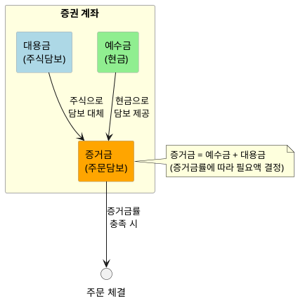

# 핵심 용어 정의

> 증권 계좌에서 사용되는 자금 관련 핵심 용어 정리

## 1. 예수금 (Deposit / Cash Balance)

**정의:** 투자자가 증권사 계좌에 예치한 **실제 현금**

### 특징
- 주식 매수에 사용 가능
- 출금 가능 (단, 결제 완료된 금액만)
- 다른 금융상품 투자에 활용 가능

### 주의점
> 예수금은 **"확정된 자금"** 과 **"예정된 자금"** 으로 나뉨
> - D+0: 현재 확정된 현금
> - D+1: 익영업일 예정 금액
> - D+2: 2영업일 후 확정될 금액

---

## 2. 증거금 (Margin)

**정의:** 주식 매수 주문 시 필요한 **최소 담보금**

### 작동 방식
- 전체 매수금액의 일정 비율(증거금률)만 현금으로 확보하면 주문 가능
- 나머지 금액은 결제일(T+2)까지 채워 넣으면 됨

### 증거금률 예시

| 증거금률 | 100만원 주문 시 필요 금액 | 비고 |
|----------|---------------------------|------|
| 100% | 100만원 | 현금 거래와 동일 |
| 40% | 40만원 | 나머지 60만원은 T+2까지 입금 |
| 20% | 20만원 | 레버리지 효과 극대화 |

### 주의점
> 증거금률이 낮을수록 레버리지가 높아지지만, **미수금 발생 위험**도 증가

---

## 3. 대용금 (Substitute Securities)

**정의:** 보유 주식을 담보로 인정받아 **증거금 대신 사용**할 수 있는 금액

### 계산 방식
```
대용금 = 보유주식 평가액 × 대용가율 (보통 50~70%)
```

### 특징
- **신용거래/선물옵션**에서 증거금 대신 활용
- 일반 현금 매수에는 사용 불가
- 주가 하락 시 대용금 가치도 하락 → 추가 담보 요구 가능

### 흔한 오해
> ❌ "대용금도 현금처럼 자유롭게 쓸 수 있다"  
> ✅ 대용금은 **담보**일 뿐, 현금이 아님. 출금/일반매수 불가

---

## 4. 미수금 (Account Receivable / Unpaid Amount)

**정의:** 증거금으로 매수 후, 결제일(T+2)까지 **부족한 잔금을 채우지 못한 금액**

### 발생 조건
1. 증거금률 < 100%로 매수
2. T+2까지 잔액 미입금
3. 보유 주식 매도대금으로도 커버 불가

### 결과
- **미수동결계좌** 지정 (30일간)
- 이후 모든 거래에서 증거금률 100% 적용
- **반대매매(강제청산)** 발생 가능

---

## 용어 관계도



---

## 한눈에 보는 비교표

| 구분 | 예수금 | 증거금 | 대용금 | 미수금 |
|------|--------|--------|--------|--------|
| **성격** | 실제 현금 | 거래 담보 | 주식 담보 | 부채 |
| **출금 가능** | ✅ (D+2 후) | ❌ | ❌ | ❌ |
| **매수 가능** | ✅ | - | 신용거래만 | ❌ |
| **발생 시점** | 입금 시 | 주문 시 | 보유 시 | 미결제 시 |

---
*다음: [02_결제주기.md](./02_결제주기.md) - T+2 결제 시스템 상세 설명*
