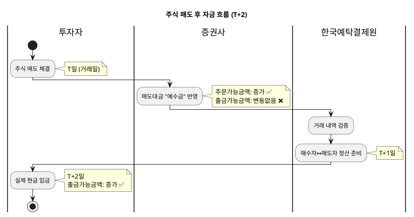
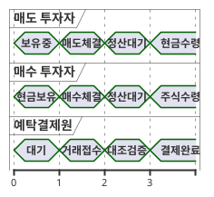

# T+2 결제 시스템

> 국내 주식시장의 3영업일 결제 주기 설명

## 1. T+2란?

**Trade Date + 2 Business Days**

- **T (거래일):** 매수/매도 주문 체결일
- **T+1:** 익영업일 (중간 정산 단계)
- **T+2:** 실제 결제일 (현금/주식 최종 이동)

### 핵심 원칙
> 오늘 주식을 팔아도, **실제 현금은 2영업일 후**에 받는다

---

## 2. 왜 바로 결제하지 않는가?

### 효율성
- 하루에 수십만 건의 거래 발생
- 실시간 이체 시 시스템 부하 + 비용 급증

### 안전성
- 한국예탁결제원이 모든 거래를 **일괄 검증 후 정산**
- 매매 오류, 사기 거래 등 사전 차단

### 글로벌 표준
- 대부분의 주요 시장이 T+2 채택 (미국은 2024년부터 T+1)
- 한국도 T+1 전환 논의 중이나, 시스템 개편 필요

---

## 3. 요일별 결제일 계산

### 기본 규칙
- **영업일 기준** (주말/공휴일 제외)
- 금융기관 정상 운영일만 카운트

### 매도 시 입금일 예시

| 매도일 | T+1 | T+2 (입금일) | 비고 |
|--------|-----|--------------|------|
| 월요일 | 화요일 | **수요일** | 일반 케이스 |
| 금요일 | 월요일 | **화요일** | 주말 건너뜀 |
| 목요일 (금 공휴일) | 월요일 | **화요일** | 공휴일 제외 |

---

## 4. 결제 주기별 자금 상태



---

## 5. 단계별 상세 설명

### T일 (거래일)

| 행동 | 계좌 변화 |
|------|-----------|
| **매수** | 증거금만큼 예수금 차감 (잔금은 T+2까지 유예) |
| **매도** | 예수금(D+2)에 반영, 즉시 재매수 가능 |

### T+1일 (중간)

- 예탁결제원에서 모든 거래 대조
- 아직 실제 자금 이동 없음
- **출금 불가** 상태 유지

### T+2일 (결제일)

| 역할 | 행동 |
|------|------|
| **매수자** | 잔금 최종 출금 (계좌에서 차감) |
| **매도자** | 매도대금 최종 입금 (출금 가능) |
| **예탁결제원** | 주식 소유권 공식 이전 |

### T+3일 (미수 발생 시)

- 매수자가 잔금 미입금 시 → **반대매매 발생**
- 오전 9시 시가에 강제 매도
- 손실 발생 가능

---

## 6. 실전 예시

### Case 1: 월요일 100만원 매도

```
월(T)  : 매도 체결 → 예수금 D+2에 100만원 표시
화(T+1): 대기 상태 (출금 불가)
수(T+2): 예수금 확정 → 출금 가능 ✅
```

### Case 2: 금요일 100만원 매도

```
금(T)  : 매도 체결 → 예수금 D+2에 100만원 표시
토/일  : 비영업일 (카운트 안함)
월(T+1): 대기 상태
화(T+2): 예수금 확정 → 출금 가능 ✅
```

### Case 3: 매도 후 즉시 재매수

```
월(T)  : A주식 100만원 매도 → 즉시 B주식 100만원 매수 가능
         (시스템이 D+2 예정 입금을 담보로 인정)
수(T+2): A 매도대금 입금 = B 매수대금 출금 → 상계처리
```

---

## 7. 자주 묻는 질문

### Q: 매도 당일 바로 다시 주식을 살 수 있나요?
> **✅ 가능합니다.** 증권사가 D+2 예정 입금을 "매수가능금액"에 반영해주기 때문입니다. 단, 그 돈을 **출금**하는 것은 불가능합니다.

### Q: 결제일을 앞당길 수 있나요?
> **❌ 불가능합니다.** T+2는 한국거래소와 예탁결제원이 정한 표준 규칙입니다.

### Q: 미국은 왜 T+1인가요?
> 미국 SEC가 2024년 5월부터 T+1으로 단축했습니다. 결제 리스크 감소와 유동성 향상이 목적입니다. 한국도 장기적으로 T+1 전환을 검토 중입니다.

---

## 8. 결제주기 다이어그램 (타임라인)



---
*다음: [03_자금흐름.md](./03_자금흐름.md) - 주문부터 결제까지 전체 라이프사이클*
