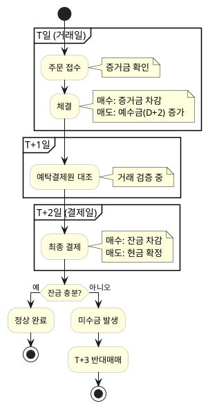
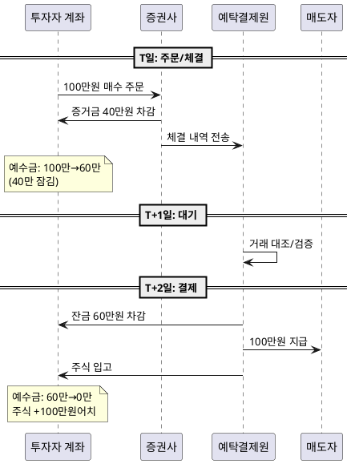
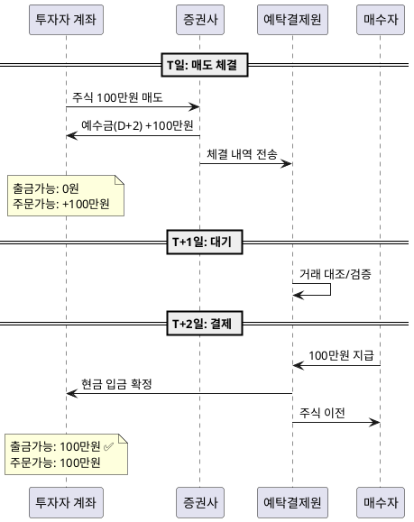
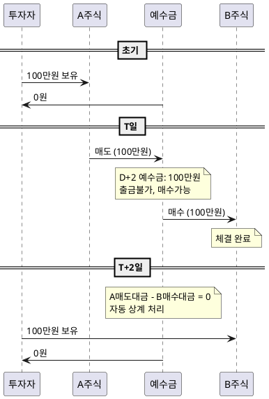

# 자금 흐름 라이프사이클

> 주문 → 체결 → 결제까지 자금이 어떻게 움직이는지 단계별 설명

## 1. 전체 흐름 개요



---

## 2. 매수 시 자금 흐름

### 시나리오: 100만원 주식 매수 (증거금률 40%)

| 단계 | 시점 | 예수금 변화 | 설명 |
|------|------|-------------|------|
| 주문 | T | -40만원 (잠김) | 증거금 40% 확보 |
| 체결 | T | 변동없음 | 주문 성공, 60만원 미결제 |
| 대기 | T+1 | 변동없음 | 예탁결제원 검증 중 |
| 결제 | T+2 | -60만원 (차감) | 잔금 최종 결제 |

### 다이어그램



---

## 3. 매도 시 자금 흐름

### 시나리오: 보유 주식 100만원 매도

| 단계 | 시점 | 예수금 | 출금가능 | 주문가능 |
|------|------|--------|----------|----------|
| 매도 전 | - | 0원 | 0원 | 0원 |
| 체결 | T | D+2: 100만원 | 0원 | 100만원 |
| 대기 | T+1 | D+1: 100만원 | 0원 | 100만원 |
| 결제 | T+2 | D+0: 100만원 | **100만원** | 100만원 |

### 핵심 포인트
> 매도 당일 **재매수는 가능**하지만, **출금은 T+2 이후**에만 가능

### 다이어그램



---

## 4. 매도 후 즉시 재매수 (Same-day Trading)

### 왜 가능한가?
증권사가 **T+2 예정 입금**을 담보로 인정하여 매수 주문을 허용

### 자금 흐름

```
[초기 상태]
- 보유: A주식 100만원
- 예수금: 0원

[T일 오전 10시] A주식 매도
- A주식: 0
- 예수금(D+2): 100만원
- 주문가능: 100만원
- 출금가능: 0원

[T일 오전 11시] B주식 100만원 매수
- B주식: 100만원어치 (체결)
- 예수금(D+2): 0원 (상계)
- 주문가능: 0원
- 출금가능: 0원

[T+2일] 결제
- A매도 대금 입금 = B매수 대금 출금 → 자동 상계
- 최종: B주식 보유, 현금 0원
```

### 다이어그램



---

## 5. 주문 취소 시 자금 흐름

### 미체결 주문 취소

| 상황 | 자금 변화 |
|------|-----------|
| 매수 주문 취소 | 증거금 즉시 반환 → 예수금 복구 |
| 매도 주문 취소 | 변동 없음 (원래 주식 유지) |

### 체결 후 취소 (불가)
> ⚠️ **체결된 거래는 취소 불가능**
> 
> 원하면 반대 매매(매수→매도 or 매도→매수)를 해야 함

---

## 6. 자금 상태 요약표

| 이벤트 | 예수금(D+0) | 예수금(D+2) | 주문가능 | 출금가능 |
|--------|-------------|-------------|----------|----------|
| 현금 입금 | +100만 | +100만 | +100만 | +100만 |
| 매수 체결 (100%) | -100만 | -100만 | -100만 | -100만 |
| 매수 체결 (40%) | -40만 | -100만 | -100만 | -40만 |
| 매도 체결 | 변동없음 | +100만 | +100만 | 변동없음 |
| T+2 도래 (매도) | +100만 | - | 변동없음 | +100만 |

---
*다음: [04_금액종류.md](./04_금액종류.md) - 주문가능/출금가능/증거금률 상세 비교*
