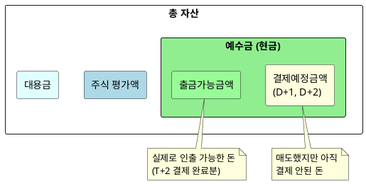
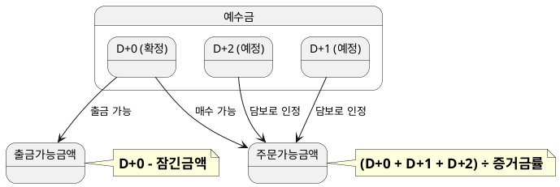

# 금액 종류 비교

> 주문가능금액, 출금가능금액, 증거금률의 차이와 계산 방식

## 1. 증권 계좌의 다양한 "금액"

HTS/MTS에서 보이는 여러 금액이 헷갈리는 이유:
> **같은 돈인데 상태에 따라 다르게 표시됨**



---

## 2. 핵심 금액 정의

### 2.1 예수금 (Cash Balance)

**정의:** 증권사 계좌에 있는 총 현금

```
예수금 = 입금액 - 출금액 - 매수정산액 + 매도정산액
```

### 2.2 주문가능금액 (Orderable Amount)

**정의:** 현재 주식을 살 수 있는 최대 금액

```
주문가능금액 = (예수금 + 매도예정금액) ÷ 증거금률
```

### 2.3 출금가능금액 (Withdrawable Amount)

**정의:** 실제로 은행 계좌로 이체할 수 있는 금액

```
출금가능금액 = 예수금(D+0) - 미결제증거금 - 청약증거금
```

### 2.4 증거금 (Margin)

**정의:** 주문 체결을 위해 담보로 잡히는 금액

```
필요증거금 = 주문금액 × 증거금률
```

---

## 3. 증거금률 이해하기

### 증거금률이란?
매수 주문 시 **즉시 확보해야 하는 현금 비율**

### 종류별 증거금률

| 종목 구분 | 증거금률 | 설명 |
|-----------|----------|------|
| 일반 종목 | 40% | KOSPI/KOSDAQ 대부분 |
| 관리종목 | 100% | 상장폐지 위험 종목 |
| 경고종목 | 100% | 투자주의 종목 |
| 신규상장 (5일) | 100% | IPO 초기 변동성 |

### 증거금률 적용 예시

| 증거금률 | 100만원 주식 매수 시 | 잔금 결제 (T+2) |
|----------|---------------------|-----------------|
| 100% | 100만원 필요 | 0원 |
| 40% | 40만원 필요 | 60만원 |
| 20% | 20만원 필요 | 80만원 |

---

## 4. 계산 예시

### 시나리오
```
현재 예수금: 100만원
오늘 A주식 매도: 50만원 (아직 미결제)
증거금률: 40%
```

### 각 금액 계산

| 항목 | 계산 | 결과 |
|------|------|------|
| **예수금(D+0)** | 100만원 | 100만원 |
| **예수금(D+2)** | 100만원 + 50만원 | 150만원 |
| **출금가능금액** | 100만원 (결제완료분만) | 100만원 |
| **주문가능금액** | (100만원 + 50만원) ÷ 0.4 | **375만원** |

### 해석
- 현재 **출금**할 수 있는 돈: 100만원
- 현재 **매수**할 수 있는 주식: 375만원어치
- 증거금률 40% 덕분에 레버리지 효과 발생

---

## 5. 금액별 비교표

| 구분 | 예수금 | 주문가능금액 | 출금가능금액 |
|------|--------|--------------|--------------|
| **포함 범위** | 확정+예정 현금 | 예수금+대용금+미결제분 | 확정 현금만 |
| **증거금률 영향** | ❌ | ✅ 나누기 적용 | ❌ |
| **매도 직후** | D+2에 반영 | 즉시 증가 | 변동 없음 |
| **출금 가능** | 부분적 | ❌ | ✅ 전액 |
| **매수 가능** | ✅ | ✅ (한도) | ✅ |

---

## 6. 실전 시나리오

### Case 1: "돈이 있는데 왜 주문이 안 되지?"

**상황:**
- 예수금: 100만원
- 오늘 B주식 매수 체결: 90만원 (증거금률 100%)
- C주식 20만원 매수 시도 → **실패**

**원인:**
```
예수금 100만원 - 증거금 90만원 = 남은 주문가능금액 10만원
→ 20만원 주문 불가
```

---

### Case 2: "출금하려는데 잔액 부족?"

**상황:**
- 예수금(D+2): 150만원
- 출금가능금액: 50만원
- 100만원 출금 시도 → **실패**

**원인:**
```
예수금 150만원 중 100만원은 아직 미결제 (D+2 예정)
→ 출금 가능한 건 확정된 50만원뿐
```

---

### Case 3: "주문가능금액이 예수금보다 많다?"

**상황:**
- 예수금: 100만원
- 증거금률: 40%
- 주문가능금액: 250만원

**원인:**
```
100만원 ÷ 0.4 = 250만원
→ 40%만 내면 되니까 2.5배까지 주문 가능
⚠️ 단, T+2까지 잔금 150만원 입금 필요!
```

---

## 7. 금액 흐름 다이어그램



---

## 8. 자주 하는 실수

| 실수 | 원인 | 해결 |
|------|------|------|
| 매도 후 바로 출금 시도 | D+2 미도래 | 2영업일 대기 |
| 주문가능금액 전부 매수 | 증거금률 < 100% 미인식 | T+2 잔금 확보 필요 |
| 대용금으로 출금 시도 | 대용금 ≠ 현금 | 매도 후 출금 |

---
*다음: [05_엣지케이스.md](./05_엣지케이스.md) - 미수금, 반대매매 등 예외 상황*
