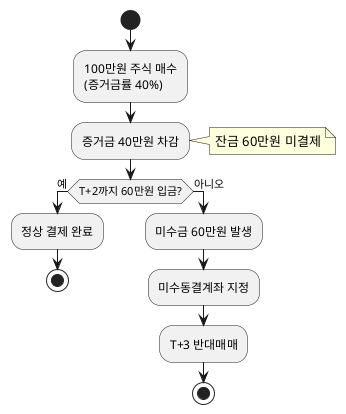
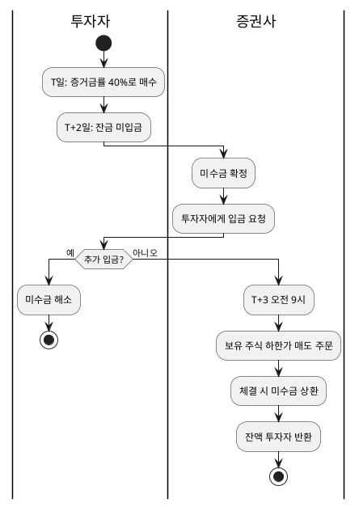

# 엣지 케이스

> 미수금, 반대매매, 미수동결 등 예외 상황 정리

## 1. 미수금 (Unpaid Amount)

### 정의
증거금만 내고 매수한 후, **T+2 결제일까지 잔금을 채우지 못한 금액**

### 발생 조건



### 미수금 계산

```
미수금 = 매수금액 - 증거금 - 보유현금 - 매도예정금
```

### 예시
```
매수금액: 100만원
증거금: 40만원 (이미 차감됨)
남은 예수금: 30만원
매도예정금: 0원

미수금 = 100만원 - 40만원 - 30만원 - 0원 = 30만원
```

---

## 2. 반대매매 (Forced Liquidation)

### 정의
미수금을 갚지 못할 때 증권사가 **강제로 보유 주식을 매도**하여 채권 회수

### 발생 시점
- **T+3일 오전 9시** (장 시작)
- 하한가로 매도 주문 → 체결 확률 극대화

### 반대매매 프로세스



### 반대매매 손실 예시

| 항목 | 금액 |
|------|------|
| 매수 금액 | 100만원 |
| 미수금 | 60만원 |
| T+3 하한가 매도 | 70만원 (30% 하락 가정) |
| 미수금 상환 | -60만원 |
| **투자자 수령** | **10만원** |
| **손실** | **-90만원** (원금 대비) |

> ⚠️ 하한가 매도로 인한 **추가 손실** 발생 가능

---

## 3. 미수동결계좌

### 정의
미수금이 발생한 계좌에 대해 **30일간 증거금률 100% 적용**

### 동결 효과

| 구분 | 일반 계좌 | 미수동결계좌 |
|------|-----------|--------------|
| 증거금률 | 40% | **100%** |
| 100만원 매수 시 필요 현금 | 40만원 | **100만원** |
| 신용거래 | 가능 | **불가** |
| 기간 | - | 30영업일 |

### 해제 조건
- 30영업일 경과
- 미수금 전액 상환
- 추가 미수 미발생

---

## 4. 세금/수수료로 인한 미세 미수금

### 발생 원인
매도 시 세금/수수료가 예상보다 많이 나와 잔액이 음수가 되는 경우

### 관련 비용

| 비용 | 요율 | 적용 시점 |
|------|------|-----------|
| 증권거래세 | 0.18~0.23% | T+2 결제 시 |
| 위탁수수료 | 0.01~0.3% | 체결 즉시 |
| 유관기관비 | 0.004% | T+2 결제 시 |

### 예시
```
계좌 잔액: 딱 100만원
매도 체결: 100만원
예상 수령: 100만원 - 세금 - 수수료 ≈ 99.7만원

→ 계좌를 0원으로 비우고 전량 매도 시
→ 세금/수수료 0.3만원이 미수금으로 발생 가능
```

### 예방법
- 항상 약간의 여유 자금 유지
- 세금/수수료 미리 계산 후 매도

---

## 5. 공휴일/주말 끼인 결제

### 문제
T+2 계산 시 **영업일만 카운트**하므로 예상과 다를 수 있음

### 예시

#### Case 1: 금요일 매도
```
금(T)   → 매도 체결
토/일   → 비영업일 (카운트 안함)
월(T+1) → 대기
화(T+2) → 결제 완료, 출금 가능
```

#### Case 2: 수요일 매도 + 금요일 공휴일
```
수(T)   → 매도 체결
목(T+1) → 대기
금      → 공휴일 (카운트 안함)
월(T+2) → 결제 완료, 출금 가능
```

### 확인 방법
- 증권사 앱에서 **예수금(D+2)** 항목 확인
- 결제예정일 캘린더 조회

---

## 6. 당일 매도-재매수 반복 (Day Trading) 주의점

### 허용 범위
- 같은 종목 매도 후 재매수: **가능**
- 다른 종목으로 회전매매: **가능**

### 위험 상황

```
1. A주식 100만원 매도 (예수금 D+2: +100만원)
2. B주식 100만원 매수 (증거금 40만원)
3. B주식 급락 → 80만원에 손절매도
4. C주식 80만원 매수 (증거금 32만원)
5. C주식 급락 → 60만원에 손절매도
...반복...

→ 실제 결제 시 손실 누적으로 미수금 발생 가능
```

### 안전 수칙
- 하루 회전매매 횟수 제한
- 손실 발생 시 즉시 현금 확보
- 증거금률 100% 종목 피하기

---

## 7. 배당/권리락 시 예수금 변동

### 배당금 지급
- 배당기준일에 보유 시 배당 대상
- 실제 입금: 배당기준일 + 약 2~3개월 후
- 예수금에 자동 입금

### 권리락 (유상증자/무상증자)
- 권리락일에 주가 조정
- 신주배정: 별도 청약 필요할 수 있음
- 청약증거금 필요 시 예수금에서 차감

---

## 8. 엣지 케이스 요약표

| 상황 | 원인 | 결과 | 예방법 |
|------|------|------|--------|
| 미수금 발생 | T+2 잔금 미입금 | 반대매매, 동결 | 여유자금 확보 |
| 반대매매 | 미수금 미상환 | 하한가 강제매도 | 입금 기한 엄수 |
| 미수동결 | 미수금 이력 | 30일간 100% 증거금 | 미수금 방지 |
| 미세 미수금 | 세금/수수료 | 소액 미수금 | 여유금 유지 |
| 결제 지연 | 공휴일/주말 | 출금 지연 | 캘린더 확인 |

---

## 9. 체크리스트

### 매수 전
- [ ] 증거금률 확인 (40%? 100%?)
- [ ] T+2 잔금 입금 가능 여부
- [ ] 주문가능금액 내 매수인지 확인

### 매도 후
- [ ] 출금은 T+2 이후 가능
- [ ] 재매수 시 미수금 위험 인지
- [ ] 세금/수수료 고려

### 미수금 발생 시
- [ ] 즉시 추가 입금
- [ ] T+3 반대매매 전 해결
- [ ] 30일 동결 각오

---
*← [00_index.md](./00_index.md)로 돌아가기*
