# 계좌 상태 변화 상세 시퀀스

> 주문 → 체결 → 결제까지 계좌 내부 필드들이 어떻게 변하는지 단계별 추적

## 1. 계좌의 핵심 필드

시퀀스를 이해하기 전에, 계좌에서 추적하는 핵심 필드를 먼저 정리합니다.

| 필드명 | 설명 | 변동 시점 |
|--------|------|-----------|
| `cash_balance` | 확정된 현금 (D+0) | 입금, 결제 완료 시 |
| `pending_settlement` | 미결제 금액 (D+1, D+2) | 체결 시 증가, 결제 시 해소 |
| `locked_margin` | 잠긴 증거금 | 주문 시 증가, 체결/취소 시 해소 |
| `orderable_amount` | 주문 가능 금액 | 실시간 계산 |
| `withdrawable_amount` | 출금 가능 금액 | 결제 완료 시 증가 |
| `stock_holdings` | 보유 주식 | 결제 완료 시 변경 |

---

## 2. 주문 시스템 참여자와 책임

### 참여자(Participant) 정의

| 참여자 | 역할 | 취소 책임 |
|--------|------|-----------|
| **투자자 (User)** | 주문 발생, 취소 요청 | 자발적 취소 요청 |
| **주문시스템 (Order)** | 주문 접수, 라우팅, 상태 관리 | ❌ 취소 발생시키지 않음 |
| **계좌원장 (Ledger)** | 잔고 확인, 증거금 관리 | 증거금 부족 시 주문 거부 |
| **체결엔진 (Matching)** | 매수-매도 매칭 | 미체결 주문 만료 처리 |
| **거래소 (Exchange)** | 시장 운영, 체결 확정 | 장 마감 시 미체결 자동 취소 |
| **예탁결제원 (KSD)** | 결제, 정산 | 결제 실패 시 거래 무효화 (극히 드묾) |

### 취소 발생 주체별 구분

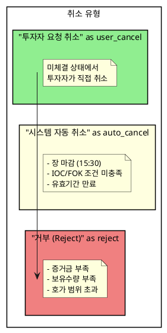

### 핵심 원칙
> **주문시스템(Order)은 취소를 "발생시키지" 않는다.**
> 
> - 주문시스템은 취소 **요청을 전달**하거나 **거부 결과를 반환**할 뿐
> - 취소의 **원인 제공자**: 투자자, 거래소, 계좌원장(잔고부족)
> - 취소의 **실행자**: 체결엔진 또는 거래소

---

## 3. 매수 주문 상세 시퀀스 (취소 포함)

### 시나리오
- 초기 예수금: 100만원
- 매수 주문: 100만원어치 (증거금률 40%)

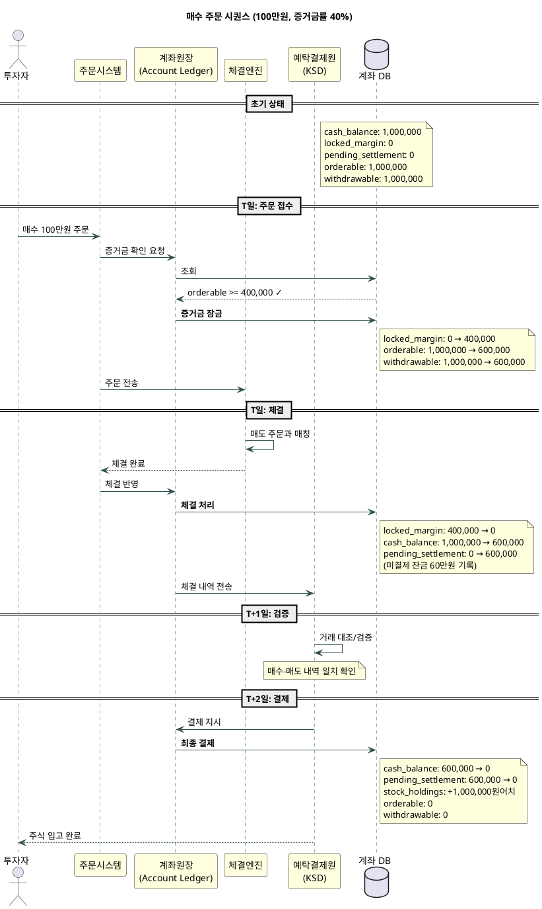

### 단계별 계좌 스냅샷

| 단계 | cash_balance | locked_margin | pending | orderable | withdrawable |
|------|--------------|---------------|---------|-----------|--------------|
| **초기** | 1,000,000 | 0 | 0 | 1,000,000 | 1,000,000 |
| **주문 접수** | 1,000,000 | **400,000** | 0 | **600,000** | **600,000** |
| **체결** | **600,000** | 0 | **600,000** | 600,000 | 600,000 |
| **T+2 결제** | **0** | 0 | 0 | 0 | 0 |

---

## 4. 취소 시나리오별 상세 시퀀스

### 4.1 투자자 요청 취소 (미체결 상태)

> **책임 주체**: 투자자 → 주문시스템(전달) → 체결엔진(실행)

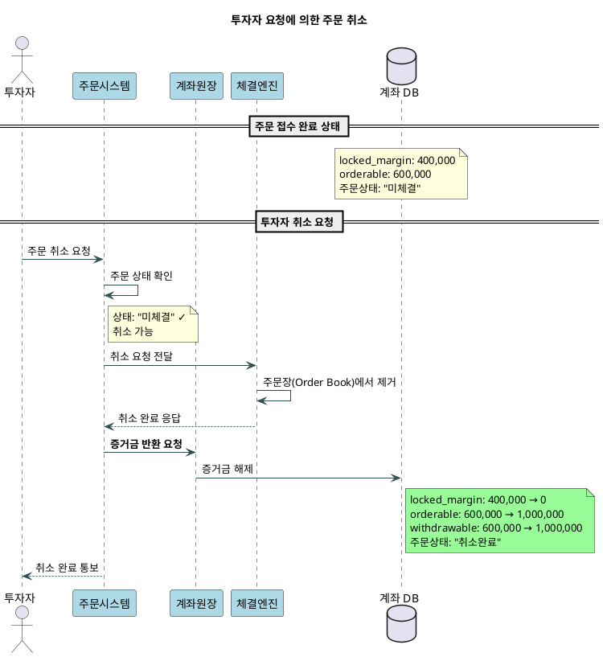

### 4.2 장 마감에 의한 자동 취소

> **책임 주체**: 거래소(시간 만료) → 체결엔진 → 주문시스템(통보)

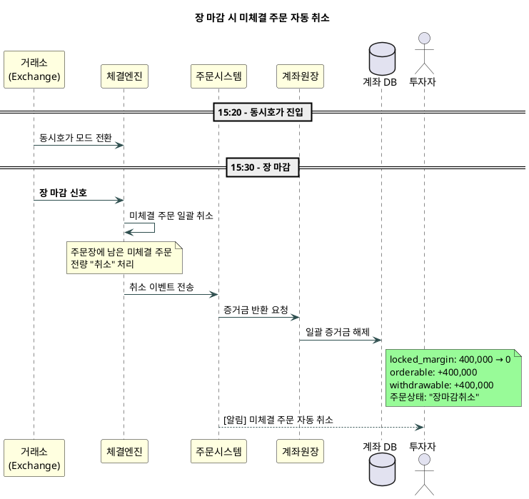

### 4.3 IOC/FOK 조건 미충족 즉시 취소

> **책임 주체**: 체결엔진(조건 판단) → 주문시스템(결과 통보)

| 조건 | 의미 | 취소 시점 |
|------|------|-----------|
| **IOC** (Immediate or Cancel) | 즉시 체결 가능한 수량만 체결, 나머지 취소 | 주문 즉시 |
| **FOK** (Fill or Kill) | 전량 체결 아니면 전량 취소 | 주문 즉시 |

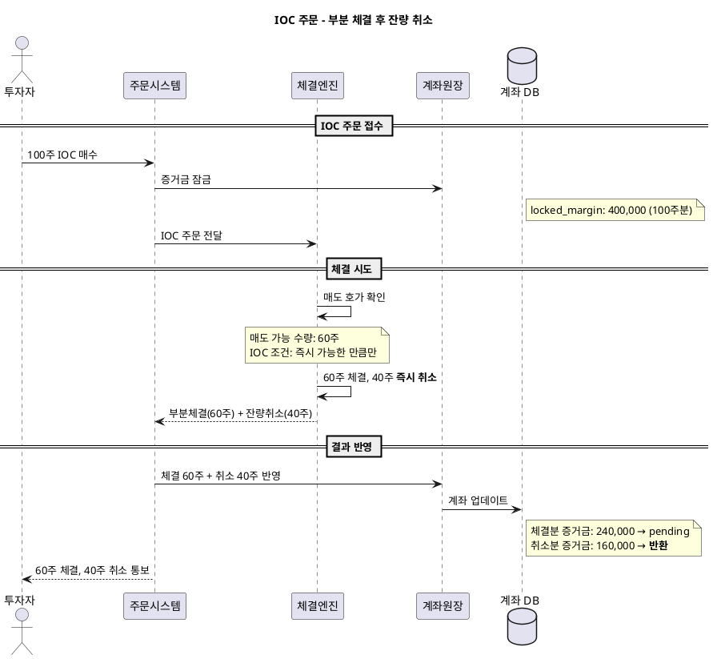

### 4.4 증거금 부족에 의한 주문 거부

> **책임 주체**: 계좌원장(잔고 검증) → 주문시스템(거부 반환)
> 
> ⚠️ 이것은 "취소"가 아니라 "거부(Reject)"

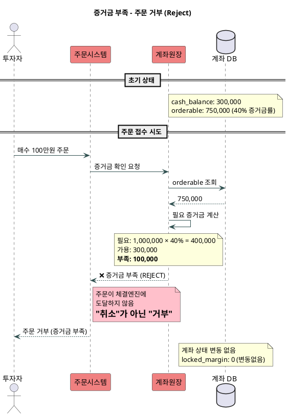

---

## 5. 취소 vs 거부 vs 체결실패 비교

| 구분 | 발생 시점 | 원인 | 증거금 | 계좌 영향 |
|------|-----------|------|--------|-----------|
| **거부 (Reject)** | 주문 접수 전 | 잔고/호가 검증 실패 | 잠기지 않음 | 없음 |
| **취소 (Cancel)** | 주문 접수 후, 체결 전 | 투자자 요청, 장마감, 조건 미충족 | 잠금 → 반환 | 원상복구 |
| **체결 (Fill)** | 매수-매도 매칭 시 | 정상 거래 | 잠금 → 정산 | 주식 이동 |
| **체결실패** | 결제 시 (T+2) | 미수금 | 부분 차감 | 반대매매 |

---

## 6. 취소 포함 전체 흐름 다이어그램

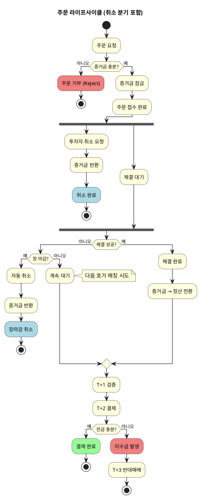

---

## 7. 매도 주문 상세 시퀀스

### 시나리오
- 초기: 주식 100만원어치 보유, 현금 0원
- 매도 주문: 100만원어치

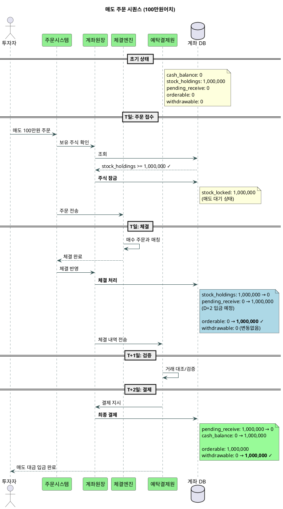

### 단계별 계좌 스냅샷

| 단계 | cash | stock | pending_receive | orderable | withdrawable |
|------|------|-------|-----------------|-----------|--------------|
| **초기** | 0 | 1,000,000 | 0 | 0 | 0 |
| **체결** | 0 | 0 | **1,000,000** | **1,000,000** | 0 |
| **T+2 결제** | **1,000,000** | 0 | 0 | 1,000,000 | **1,000,000** |

> 💡 **핵심 포인트**: 체결 직후 `orderable`은 즉시 증가하지만, `withdrawable`은 T+2 결제 후에야 증가

---

## 8. 매도 → 즉시 매수 시퀀스 (Same-day Trading)

### 시나리오
- A주식 100만원 매도 → 즉시 B주식 100만원 매수

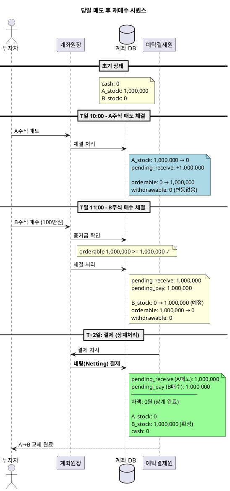

### 상계(Netting) 처리 원리

```
T+2 결제 시점:
┌─────────────────────────────────────┐
│  받을 돈 (A매도):    +1,000,000원   │
│  줄 돈 (B매수):      -1,000,000원   │
│  ─────────────────────────────────  │
│  실제 이체 금액:            0원     │
└─────────────────────────────────────┘
→ 예탁결제원에서 자동 상계 처리
→ 실제 현금 이동 없이 주식만 교환
```

---

## 9. 미수금 발생 시퀀스

### 시나리오
- 예수금: 50만원
- 매수: 100만원 (증거금률 40% → 필요 증거금 40만원)
- T+2까지 추가 입금 없음

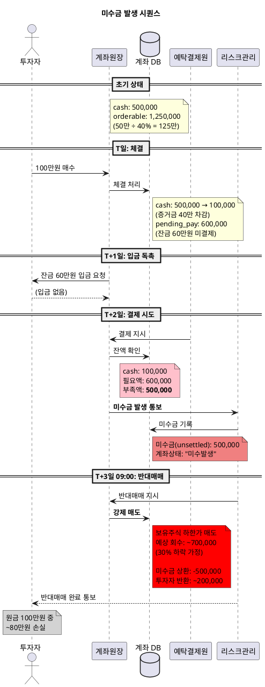

---

## 10. 계좌 상태 전이 다이어그램

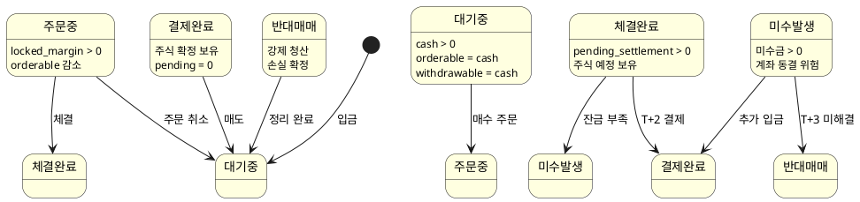

---

## 11. 요약: 필드별 변동 타이밍

| 이벤트 | cash | locked | pending | orderable | withdrawable | stock |
|--------|------|--------|---------|-----------|--------------|-------|
| 매수 주문 | - | ↑ | - | ↓ | ↓ | - |
| 매수 체결 | ↓ | ↓ | ↑ | - | - | - |
| 매수 T+2 결제 | ↓ | - | ↓ | - | ↓ | ↑ |
| 매도 체결 | - | - | ↑(수취) | ↑ | - | ↓ |
| 매도 T+2 결제 | ↑ | - | ↓ | - | ↑ | - |
| **주문 취소** | - | **↓** | - | **↑** | **↑** | - |
| **주문 거부** | - | - | - | - | - | - |

---

## 12. 취소 책임 요약

```
┌──────────────────────────────────────────────────────────────┐
│                    취소/거부 책임 체계                        │
├──────────────────────────────────────────────────────────────┤
│                                                              │
│  [증거금 부족]                                               │
│       ↓                                                      │
│  계좌원장 → 주문시스템 → 투자자                              │
│  (검증실패)   (거부반환)   (거부통보)                         │
│                                                              │
│  [투자자 취소 요청]                                          │
│       ↓                                                      │
│  투자자 → 주문시스템 → 체결엔진 → 계좌원장                   │
│  (요청)    (전달)      (실행)     (증거금반환)                │
│                                                              │
│  [장 마감 / 조건 미충족]                                     │
│       ↓                                                      │
│  거래소/체결엔진 → 주문시스템 → 계좌원장                     │
│  (자동취소)        (통보)      (증거금반환)                   │
│                                                              │
└──────────────────────────────────────────────────────────────┘

💡 핵심: 주문시스템(Order)은 "전달자" 역할
   - 취소를 발생시키지 않음
   - 취소 요청을 라우팅하고 결과를 통보
```

---
*← [03_자금흐름.md](./03_자금흐름.md) | [00_index.md](./00_index.md)*
