# 체결엔진 (Matching Engine)

> 주문을 받아 매수-매도를 매칭하고 체결을 확정하는 핵심 시스템

## 1. 체결엔진이란?

**체결엔진(Matching Engine)**은 증권 거래소의 심장부로, 투자자들의 매수/매도 주문을 받아 **가격-시간 우선 원칙**에 따라 매칭하고 거래를 성사시키는 시스템입니다.

### 핵심 역할

| 역할 | 설명 |
|------|------|
| **주문 접수** | 브로커(증권사)로부터 주문을 수신 |
| **주문장 관리** | Order Book에 미체결 주문을 정렬/보관 |
| **매칭 실행** | 매수-매도 주문을 규칙에 따라 매칭 |
| **체결 확정** | 매칭된 거래를 확정하고 결과 전파 |
| **미체결 처리** | 조건 미충족 주문 취소, 장 마감 처리 |

### 시스템 위치

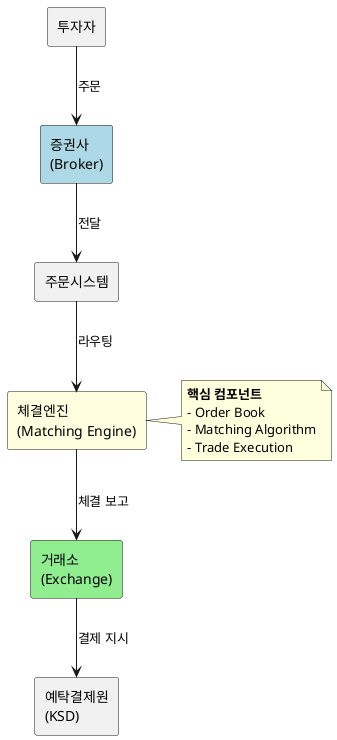

---

## 2. Order Book (주문장)

### 구조

Order Book은 특정 종목에 대한 모든 미체결 주문을 가격별로 정렬한 데이터 구조입니다.

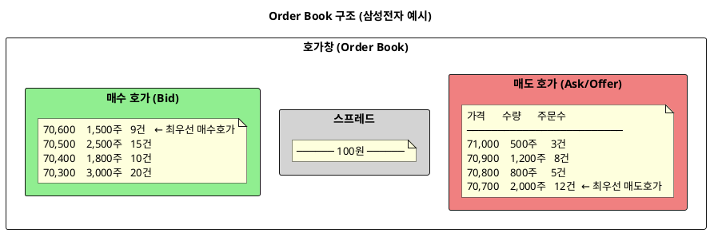

### Order Book 용어

| 용어 | 설명 |
|------|------|
| **Bid** | 매수 호가 (사고 싶은 가격) |
| **Ask/Offer** | 매도 호가 (팔고 싶은 가격) |
| **Best Bid** | 최우선 매수호가 (가장 높은 매수가) |
| **Best Ask** | 최우선 매도호가 (가장 낮은 매도가) |
| **Spread** | Best Ask - Best Bid (호가 갭) |
| **Depth** | 각 가격대의 주문 수량 |

### 데이터 구조 (개념적)

```
OrderBook {
  symbol: "005930"  // 삼성전자
  
  bids: [  // 매수 호가 (내림차순 정렬)
    { price: 70600, orders: [Order1, Order2, ...] },
    { price: 70500, orders: [Order3, Order4, ...] },
    ...
  ]
  
  asks: [  // 매도 호가 (오름차순 정렬)
    { price: 70700, orders: [Order5, Order6, ...] },
    { price: 70800, orders: [Order7, ...] },
    ...
  ]
}
```

---

## 3. Price-Time Priority (가격-시간 우선 원칙)

### 알고리즘 원리

체결엔진의 핵심 매칭 알고리즘은 **Price-Time Priority (FIFO)** 방식입니다.

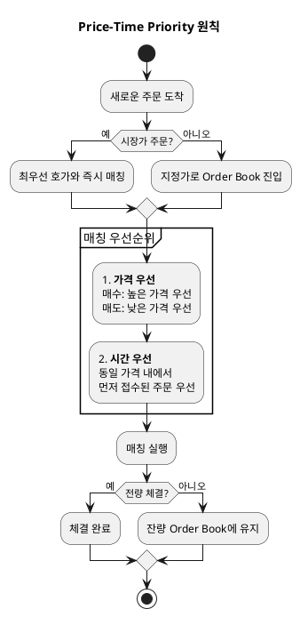

### 예시: 매수 주문 매칭

```
현재 Order Book (매도 호가):
┌─────────────────────────────────────────┐
│  가격     수량    접수시간   주문번호   │
├─────────────────────────────────────────┤
│  70,700   500주   09:00:01   A001       │
│  70,700   300주   09:00:05   A002       │  ← 동일 가격, 시간 우선
│  70,700   200주   09:00:10   A003       │
│  70,800   1000주  09:00:02   A004       │
└─────────────────────────────────────────┘

새로운 매수 주문: 70,700원에 600주

체결 순서:
1. A001 전량 체결 (500주)
2. A002 부분 체결 (100주)
   → A002 잔량 200주는 Order Book에 유지
```

---

## 4. 주문 유형과 체결엔진 처리

### 주문 유형별 처리 방식

| 주문 유형 | 체결엔진 처리 | 미체결 시 |
|-----------|---------------|-----------|
| **시장가 (Market)** | 최우선 호가로 즉시 매칭 | 잔량 다음 호가로 계속 |
| **지정가 (Limit)** | 지정 가격 이상/이하에서만 매칭 | Order Book에 대기 |
| **IOC** | 즉시 가능한 수량만 체결 | 잔량 **즉시 취소** |
| **FOK** | 전량 체결 가능할 때만 체결 | 불가 시 **전량 취소** |
| **GTC** | 취소 전까지 유효 | 무기한 대기 |

### IOC/FOK 처리 시퀀스

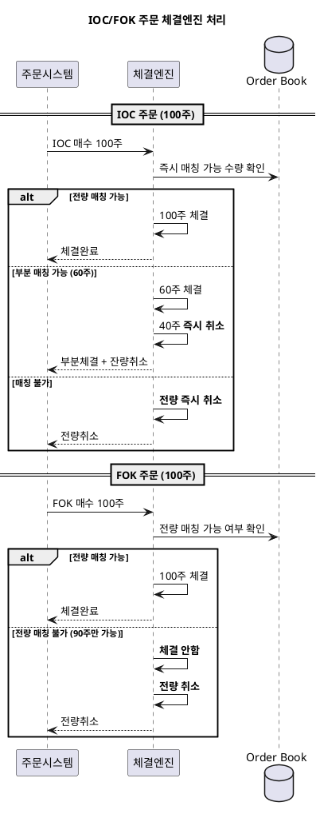

---

## 5. KRX EXTURE+ 시스템

한국거래소(KRX)의 체결엔진 시스템인 **EXTURE+**에 대해 알아봅니다.

### 시스템 개요

| 항목 | 내용 |
|------|------|
| **명칭** | EXTURE+ (EXchange Trading Using Reliable Engine) |
| **도입** | 2014년 (EXTURE 3.0), 2023년 고도화 |
| **플랫폼** | Linux 기반 |
| **처리속도** | 50-70μs (마이크로초) 레벨 |
| **처리용량** | 초당 수만 건 이상 |

### 아키텍처 특징

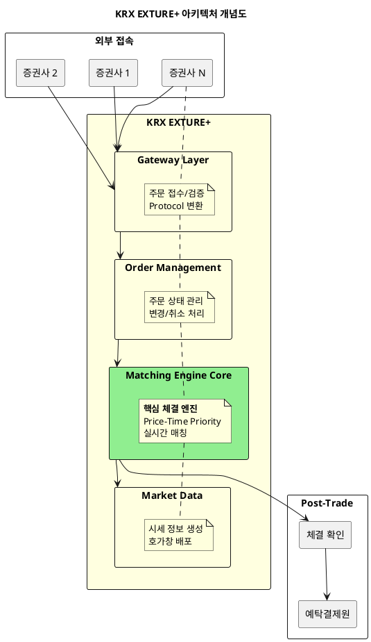

### 성능 최적화 기법

1. **In-Memory 처리**: Order Book을 메모리에 유지
2. **Lock-Free 알고리즘**: 동시성 최적화
3. **Event-Driven**: 비동기 이벤트 기반 처리
4. **Co-location**: 증권사 서버를 거래소 내 배치 허용

---

## 6. 체결엔진의 책임 범위

### 체결엔진이 **하는 것**

| 책임 | 상세 |
|------|------|
| Order Book 관리 | 미체결 주문 저장, 정렬, 검색 |
| 매칭 실행 | Price-Time Priority로 주문 매칭 |
| 체결 확정 | 매칭된 거래를 확정하고 ID 부여 |
| 조건부 취소 | IOC/FOK 미충족, 장 마감 시 미체결 취소 |
| 시세 정보 생성 | 체결가, 거래량, 호가창 정보 배포 |

### 체결엔진이 **하지 않는 것**

| 책임 없음 | 담당 시스템 |
|-----------|-------------|
| 증거금 확인 | 계좌원장 (Account Ledger) |
| 투자자 인증 | 증권사 (Broker) |
| 결제 실행 | 예탁결제원 (KSD) |
| 리스크 관리 | 리스크 시스템 |
| 투자자 취소 요청 접수 | 주문시스템 (Order) |

### 책임 경계 다이어그램

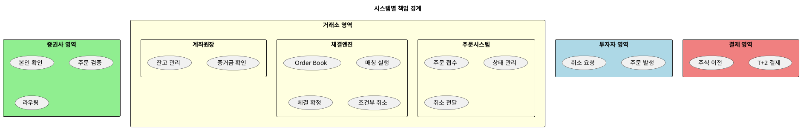

---

## 7. 취소 발생과 체결엔진

### 체결엔진이 취소를 발생시키는 경우

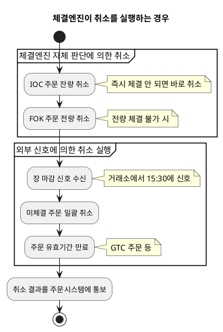

### 체결엔진이 취소를 실행만 하는 경우

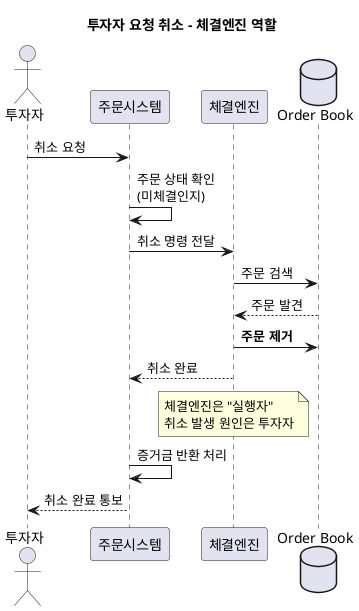

---

## 8. 체결 상세 시퀀스

### 매수-매도 매칭 과정

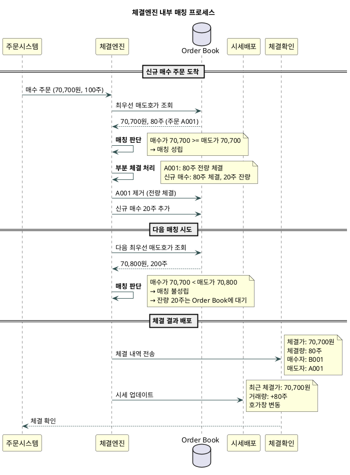

---

## 9. 장 운영과 체결엔진

### 장 시간별 동작 모드

| 시간 | 모드 | 체결엔진 동작 |
|------|------|---------------|
| 08:30-09:00 | 동시호가 (개장 전) | 주문 접수, 매칭 보류 |
| 09:00 | 개장 | 동시호가 일괄 체결 |
| 09:00-15:20 | 접속매매 | 실시간 연속 매칭 |
| 15:20-15:30 | 동시호가 (종가) | 주문 접수, 매칭 보류 |
| 15:30 | 장 마감 | 동시호가 체결 + 미체결 취소 |
| 15:40-16:00 | 시간외 단일가 | 단일가 매칭 |

### 동시호가 체결 원리

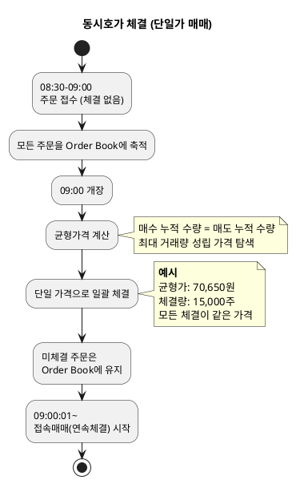

---

## 10. 체결엔진 장애 대응

### 장애 유형과 대응

| 장애 유형 | 영향 | 대응 |
|-----------|------|------|
| 체결엔진 지연 | 체결 속도 저하 | 큐잉, 재시도 |
| 체결엔진 중단 | 거래 중단 | 장 일시 정지, Failover |
| 데이터 불일치 | 호가창 오류 | 동기화, 재구성 |

### Failover 구조

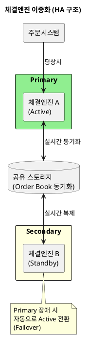

---

## 11. 요약: 체결엔진 핵심 포인트

```
┌────────────────────────────────────────────────────────────┐
│                    체결엔진 핵심 요약                       │
├────────────────────────────────────────────────────────────┤
│                                                            │
│  1. Order Book = 미체결 주문의 정렬된 저장소               │
│     - Bid (매수): 높은 가격 우선                           │
│     - Ask (매도): 낮은 가격 우선                           │
│                                                            │
│  2. Price-Time Priority = 핵심 매칭 알고리즘               │
│     - 1순위: 가격 (유리한 가격 우선)                       │
│     - 2순위: 시간 (먼저 들어온 주문 우선)                  │
│                                                            │
│  3. 체결엔진의 취소 책임                                   │
│     - 스스로 취소: IOC/FOK 잔량, 장마감 미체결             │
│     - 전달받아 실행: 투자자 취소 요청                      │
│                                                            │
│  4. KRX EXTURE+ = 한국 주식시장 체결엔진                   │
│     - 50-70μs 처리 속도                                    │
│     - Linux 기반, In-Memory 처리                           │
│                                                            │
│  5. 체결엔진 ≠ 결제                                        │
│     - 체결: 거래 성사 (T일)                                │
│     - 결제: 실제 주식/현금 이전 (T+2일, KSD)               │
│                                                            │
└────────────────────────────────────────────────────────────┘
```

---

*← [06_계좌시퀀스.md](./06_계좌시퀀스.md) | [00_index.md](./00_index.md)*
