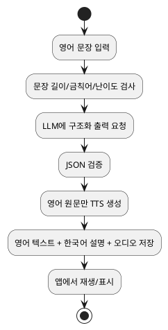

# 아이용 영어 문장 학습 파이프라인 연구 개요

## 한눈에 보기

- 구상 자체는 충분히 현실적이다.
- 가장 단순한 첫 버전은 `LLM으로 한국어 설명 생성 -> 영어 원문만 TTS로 음성화` 구조가 적합하다.
- `영어 문장`과 `한국어 설명`을 같은 TTS로 한 번에 읽게 하기보다, 영어 발음용 오디오와 한국어 설명 텍스트를 분리하는 편이 품질과 운영 면에서 유리하다.
- 하나의 플랫폼으로 최대한 묶고 싶다면 현재 기준으로는 `Google Vertex AI + Google Cloud TTS` 조합이 가장 현실적이다.
- 영어 발음의 자연스러움을 최우선으로 두면 `ElevenLabs`를 TTS 전용으로 붙이는 하이브리드 구성이 강하다.

## 왜 이 구상이 현실적인가

사용자가 `I am a boy.` 같은 쉬운 문장을 입력하면, 현재 상용 LLM은 아래 정보를 충분히 안정적으로 만들 수 있다.

1. 쉬운 한국어 뜻
2. 문장 구성 설명
3. 아이 눈높이에 맞춘 짧은 보충 설명
4. 필요하면 쉬운 예문 1~2개

그리고 상용 TTS는 짧은 영어 문장을 자연스럽게 읽는 데 이미 충분한 수준에 도달해 있다. 특히 영어 단문 위주 학습은 TTS가 잘하는 영역이다.

즉, 기술적으로 어려운 문제는 `만들 수 있느냐`보다 아래 4가지다.

- 발음이 실제 학습용으로 충분히 좋은가
- 설명이 아이 수준에 맞게 과하지 않게 나오는가
- 비용이 너무 커지지 않는가
- 운영 중 품질 흔들림을 어떻게 줄일 것인가

## 추천 제품 구조

## 추천 결론

### 1. MVP

가장 좋은 시작점은 아래 구조다.

- 입력: 영어 문장 1개
- LLM 출력:
  - `spoken_text_en`: TTS에 넣을 영어 문장
  - `meaning_ko`: 뜻
  - `structure_ko`: 문장 구성 설명
  - `teacher_note_ko`: 아이용 가벼운 설명
- TTS 입력: `spoken_text_en`만 사용
- 화면 출력: 영어 문장 + 한국어 설명 + 재생 버튼

이 구조가 좋은 이유는 다음과 같다.

- 영어 발음 품질과 한국어 설명 품질을 분리할 수 있다.
- TTS 비용이 작다.
- 설명 문구를 바꿔도 오디오는 다시 만들 필요가 없다.
- 나중에 퀴즈, 반복 재생, 속도 조절을 붙이기 쉽다.

### 2. V2

MVP가 잘 되면 다음 확장을 고려할 수 있다.

- 영어 오디오 뒤에 한국어 설명 오디오를 이어 붙이기
- 단어별 강조 재생
- 느리게 읽기 / 보통 속도 읽기 2종 생성
- 학년별 설명 톤 분기
- 부모용 해설과 아이용 해설 분리
- 발음 비교용 음성 입력 평가 추가

## 플랫폼 선택

## A안: Google 중심 단일 벤더 전략

가장 현실적인 `거의 한 플랫폼` 접근이다.

- LLM: Gemini 계열
- TTS: Google Cloud TTS `Chirp 3 HD` 또는 `Gemini-TTS`
- 장점:
  - 한국어와 영어 모두 지원 범위가 넓다.
  - 문서와 운영 체계가 비교적 일관적이다.
  - 발음 제어, 속도 조절, 일부 커스텀 발음 제어가 가능하다.
  - 나중에 STT까지 붙이기 쉽다.
- 단점:
  - 영어 자연스러움만 놓고 보면 일부 경우 ElevenLabs가 더 좋게 들릴 수 있다.
  - 콘솔, 권한, 과금 구조가 초반엔 조금 무겁다.

### Google이 특히 잘 맞는 경우

- 한국어 설명도 중요하다.
- 나중에 말하기 평가까지 넣고 싶다.
- 한 벤더 안에서 오래 운영하고 싶다.
- 교육 서비스답게 안정성과 확장성을 우선한다.

## B안: LLM + ElevenLabs 하이브리드 전략

품질 우선 전략이다.

- LLM: OpenAI 또는 Gemini
- TTS: ElevenLabs
- 장점:
  - 영어 발음과 음성 자연스러움이 매우 강하다.
  - 교육용 오디오가 더 덜 기계적으로 들릴 가능성이 높다.
  - 음성 브랜딩이나 캐릭터 보이스 확장에 유리하다.
- 단점:
  - 완전한 올인원은 아니다.
  - 비용이 더 높아질 수 있다.
  - 발음 사전, 스타일, 음성 선택 정책을 따로 관리해야 한다.

### ElevenLabs가 특히 잘 맞는 경우

- 영어 듣기 경험이 제품 경쟁력의 핵심이다.
- 짧은 예문도 더 감정적이고 자연스럽게 들리길 원한다.
- 콘텐츠형 학습 앱처럼 오디오 경험을 크게 본다.

## C안: OpenAI 중심 단순화 전략

가장 간단한 개발 경험을 노릴 수 있다.

- LLM: OpenAI
- TTS: OpenAI `gpt-4o-mini-tts`
- 장점:
  - 구현이 간단하다.
  - LLM과 TTS를 같은 API 계열로 관리할 수 있다.
  - 빠른 프로토타이핑에 좋다.
- 단점:
  - 공식 문서 기준으로 음성은 영어 최적화 성격이 강하다.
  - 영어는 좋지만, 다국어 음성 전략까지 보면 Google이나 Azure보다 선택 폭이 좁다.
  - 발음 세밀 제어는 Google 계열보다 약한 편이다.

### OpenAI가 특히 잘 맞는 경우

- 아주 빠르게 데모를 만들고 싶다.
- 초기 사용자 테스트가 먼저다.
- 발음 품질 최상위보다 개발 속도를 우선한다.

## D안: Azure 중심 전략

엔터프라이즈 운영 쪽에 강한 선택지다.

- LLM: Azure OpenAI 또는 별도 LLM
- TTS: Azure Speech HD / Dragon HD Omni
- 장점:
  - 언어와 보이스 폭이 넓다.
  - SSML, 엔터프라이즈 운영, 음성 이벤트 지원이 강하다.
  - 장기 운영 관점에서 제어 옵션이 많다.
- 단점:
  - MVP 관점에서는 다소 무겁다.
  - 초반 설정 난이도가 Google/OpenAI보다 높게 느껴질 수 있다.

## 현실적인 추천 순위

### 1위: Google 중심

가장 균형이 좋다.

- 이유: 한국어 설명 + 영어 음성 + 장기 확장 + 발음 제어의 균형이 가장 좋다.
- 추천 조합:
  - 설명 생성: Gemini Flash 급 모델
  - 음성 생성: Chirp 3 HD 또는 Gemini-TTS

### 2위: Gemini 또는 OpenAI + ElevenLabs

듣기 경험을 더 좋게 만들고 싶을 때 강하다.

- 이유: 영어 오디오 품질을 우선하면 만족도가 높을 가능성이 크다.
- 단, 비용과 구성 복잡도는 조금 올라간다.

### 3위: OpenAI 단일 스택

가장 빠른 시작용이다.

- 이유: 개발 속도가 빠르다.
- 단, 장기적으로는 TTS 부분만 다른 벤더로 교체할 가능성이 크다.

## 권장 파이프라인 설계

## LLM 프롬프트 설계 원칙

아이용 서비스에서는 자유 서술보다 구조화 출력이 중요하다.

- 출력은 JSON으로 제한한다.
- 설명 길이는 짧게 제한한다.
- 어려운 문법 용어를 금지한다.
- 학년 또는 연령대를 입력 파라미터로 받는다.
- 문장이 이상하거나 어색하면 `자연스러운 표현 아님`을 표시하게 한다.

예시 필드:

- `meaning_ko`
- `structure_ko`
- `easy_points_ko`
- `is_natural`
- `natural_rewrite_en`
- `tts_text_en`

## 꼭 이렇게 나누는 것이 좋은 이유

예를 들어 사용자가 `I am a boy`를 넣었을 때, LLM이 아래처럼 판단할 수 있다.

- 뜻: `나는 남자아이야.`
- 구성: `I = 나는`, `am = 이다`, `a boy = 남자아이`
- 보충: `I am ...`은 `나는 ...이야`라고 말할 때 자주 쓴다.

여기서 TTS는 `I am a boy.`만 읽게 두는 편이 좋다.

만약 한국어 설명까지 한 오디오에 같이 넣으면 아래 문제가 생긴다.

- 영어 학습 리듬이 깨진다.
- 한국어 TTS 품질까지 같이 신경 써야 한다.
- 문구 수정 때마다 오디오를 다시 생성해야 한다.

따라서 초반에는 `영어 오디오 1개 + 한국어 텍스트 설명` 구성이 가장 낫다.

## 품질 리스크

### 1. 쉬운 문장인데 설명이 너무 길어질 수 있음

해결:

- 글자 수 제한
- 문장 수 제한
- 어려운 문법 용어 금지

### 2. 어색한 영어 문장을 그대로 읽게 될 수 있음

해결:

- `is_natural` 판정 필드 추가
- 필요 시 `추천 자연 표현` 함께 제시

### 3. 이름, 약어, 고유명사 발음이 틀릴 수 있음

해결:

- 발음 예외 사전 구축
- Google/Azure 계열의 custom pronunciation 또는 SSML 활용
- 자주 쓰는 학습 문장 세트는 사전 검수

### 4. 아이 대상 설명이 부적절하게 생성될 수 있음

해결:

- 허용 톤 가이드 고정
- 금지 표현 목록 운영
- 샘플 평가 세트로 정기 점검

## 비용 관점

이 서비스는 대체로 `설명 생성 비용`보다 `오디오 생성 비용`이 더 체감될 가능성이 높다. 다만 문장이 매우 짧다면 둘 다 충분히 작게 시작할 수 있다.

비용을 낮추는 방법:

- 같은 문장은 캐시한다.
- TTS는 영어 원문에만 쓴다.
- 설명은 구조화된 짧은 출력으로 제한한다.
- 인기 문장은 사전 생성해 둔다.

## 최종 판단

- 이 아이디어는 충분히 현실적이다.
- 다만 `LLM이 모든 걸 하고 TTS가 그 결과를 전부 읽는다`보다, `LLM은 설명을 만들고 TTS는 영어 원문만 읽는다`가 더 좋은 제품 구조다.
- `꼭 하나의 플랫폼`을 원하면 Google 계열이 가장 현실적이다.
- `영어 발음 품질이 절대적으로 중요`하면 ElevenLabs를 TTS 전용으로 쓰는 하이브리드가 더 낫다.
- MVP는 기술 과시보다 `짧고 정확한 설명 + 좋은 영어 발음 + 반복 재생 UX`에 집중하는 편이 성공 확률이 높다.

## 권장 실행안

### 바로 시작할 조합

- 1안: `Gemini Flash + Google Cloud TTS`
- 2안: `Gemini Flash 또는 OpenAI + ElevenLabs`
- 3안: `OpenAI LLM + OpenAI TTS`로 초고속 프로토타입 후 TTS만 교체

### MVP 범위

- 영어 문장 입력
- 영어 음성 재생
- 뜻
- 문장 구성 설명
- 아이용 한 줄 설명
- 다시 듣기

### MVP에서 굳이 안 넣어도 되는 것

- 실시간 대화형 음성 에이전트
- 캐릭터 음성 여러 개
- 긴 한국어 음성 설명
- 고급 발음 채점

## 참고 문서

- 세부 출처는 `english-learning-tts/sources.md`에 정리했다.
- 추천안 비교는 `english-learning-tts/01_추천아키텍처비교.md`에 정리했다.
- API 스키마 초안은 `english-learning-tts/02_API입출력스키마.md`에 정리했다.
- MVP 제품 요구사항은 `english-learning-tts/03_MVP_PRD.md`에 정리했다.

## 문서 구성

1. `00_개요.md` - 전체 방향, 현실성 판단, 플랫폼 선택 기준
2. `01_추천아키텍처비교.md` - 추천 2안과 빠른 프로토타입 1안 비교
3. `02_API입출력스키마.md` - 바로 개발 가능한 입력/출력 구조 초안
4. `03_MVP_PRD.md` - MVP 범위, 사용자 흐름, 요구사항, 지표
5. `sources.md` - 조사 출처 정리
