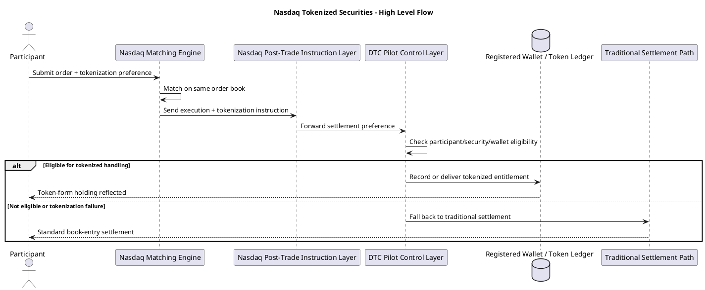

# 나스닥 주식 토큰 거래 구조와 시스템 메모

## 문서 목적

이 문서는 비전문가용 요약이 아니라, 2026년 3월 기준 공개 자료를 바탕으로 `나스닥 토큰화 증권 거래가 어떤 시장 구조와 시스템 구조로 설계되는지`를 전문가 관점에서 정리한 메모다.

핵심 결론부터 말하면, 이번 구조는 `새로운 탈중앙 거래소를 만드는 것`이 아니라 `기존 미국 증권시장 인프라 위에 토큰화 결제 경로를 덧붙이는 방식`이다. 즉, 거래는 기존 나스닥 시장 구조 안에서 일어나고, 토큰화는 주로 사후 결제와 권리 표현의 레이어로 붙는다.

## 1. 제도적 위치: 새로운 시장이 아니라 기존 시장의 확장

공개 자료상 2026년 3월 SEC는 나스닥의 규칙 변경을 승인해, 일부 증권이 `traditional form`과 `tokenized form`으로 모두 거래될 수 있는 틀을 열었다. 다만 이것은 기존 규제 체계를 우회하는 구조가 아니다.

- 거래소는 여전히 `Nasdaq`
- 중앙예탁 및 사후처리 핵심 축은 여전히 `DTC`
- 토큰화는 `DTC Pilot` 안에서만 허용
- 대상도 전 종목이 아니라 `Russell 1000 구성주` 및 일부 주요 지수 ETF 중심

즉, 이 구조의 철학은 `블록체인으로 월가를 대체`가 아니라 `월가의 기존 신뢰 인프라 위에 블록체인을 부분 도입`에 가깝다.

## 2. 시장 구조: 주문은 하나, 결제 선호만 달라짐

가장 중요한 포인트는 `토큰화 주식 전용 오더북이 따로 생기지 않는다`는 점이다.

- 토큰화 증권과 기존 증권은 `같은 주문장`에서 거래된다.
- `같은 티커`, `같은 CUSIP`, `같은 가격 형성` 원리를 따른다.
- 실행 우선순위는 기존과 동일하게 `price-time priority`를 유지한다.
- 주문이 토큰화 결제를 원한다고 해서 매칭 엔진이 별도 우대를 하지는 않는다.

따라서 시장 미시구조 관점에서 보면, 이번 변화는 `matching layer`보다 `post-trade instruction layer`의 변화에 가깝다.

## 3. 주문 입력 단계: 토큰화 플래그가 붙는 구조

공개 설명에 따르면, 나스닥 참여자는 주문 입력 시 특정 `tokenization flag` 또는 이에 준하는 지정 필드를 사용해 토큰화 결제 선호를 표시할 수 있다.

이 플래그의 역할은 다음과 같다.

- 이 주문이 체결되면 `전통적 결제`가 아니라 `토큰 형태의 결제/인도`를 원한다는 의사 표시
- 해당 주문이 토큰화 대상 증권인지 식별하는 보조 정보
- DTC가 사후처리할 때 필요한 `등록된 지갑 주소` 등과 연결되는 신호 역할

중요한 점은, 이 플래그가 `시장가격 형성`을 바꾸는 것이 아니라 `체결 후 어떤 형태로 결제할지`를 지정한다는 것이다.

## 4. 동일성 보장: 토큰이 별도 자산이 되지 않도록 설계

이번 구조의 핵심 안정장치는 `fungibility`, 즉 대체가능성 유지다.

토큰화된 증권이 기존 주식과 동일 자산으로 간주되려면 공개 자료상 다음 성격을 만족해야 한다.

- 동일한 `CUSIP`
- 동일한 `trading symbol`
- 동일한 `주주 권리`
- 동일한 `경제적 이해`

즉, 토큰이 새로운 파생상품이나 래핑 자산으로 따로 떠다니면 안 되고, 기존 주식의 법적/경제적 실체와 붙어 있어야 한다.

이 설계는 매우 중요하다. 왜냐하면 토큰화 주식이 기존 주식과 다른 자산으로 취급되면, 유동성은 분리되고 가격도 갈라지며 규제와 공시 체계도 복잡해지기 때문이다. 나스닥 구조는 이를 피하기 위해 `같은 자산의 다른 표현 방식`으로 토큰을 위치시키고 있다.

## 5. DTC의 역할: 시스템의 중심 허브

기술적으로 블록체인이 등장하지만, 실제 구조의 목은 여전히 `DTC`다.

공개 자료를 종합하면 DTC는 다음 역할을 맡는다.

- 파일럿 참여 자격을 관리
- 토큰화 가능한 증권 범위를 관리
- 등록된 블록체인과 지갑 주소를 관리
- 체결 후 토큰화 요청을 받아 실제 토큰 표현을 생성 또는 반영
- 필요시 토큰화 실패 주문을 기존 방식으로 되돌리는 fallback 처리 수행

즉, 블록체인 네트워크가 있다고 해도 `진실의 원장`을 완전히 퍼블릭 체인에 넘기는 구조가 아니라, `DTC 통제 아래 분산원장을 보조 사용`하는 구조에 가깝다.

## 6. 청산·결제 경로: 거래 즉시 온체인 최종결제는 아님

많은 사람이 주식 토큰 거래를 들으면 바로 `T+0`나 `24시간 즉시 결제`를 떠올리지만, 현재 공개된 파일럿 구조는 훨씬 보수적이다.

전형적인 흐름은 아래와 같이 이해하는 것이 맞다.

```text
1) 참가자가 나스닥에 주문 제출
2) 주문장 내에서 기존 방식대로 매칭
3) 체결 결과와 토큰화 선호 정보가 사후처리 단계로 전달
4) DTC가 참여자 자격, 증권 자격, 지갑 등록 상태 등을 확인
5) 조건 충족 시 해당 보유분을 토큰 형태 entitlement로 반영
6) 실패 시 기존 비토큰 방식으로 결제
```

즉, 현재 단계는 `매칭 엔진 자체가 온체인에서 돌고, 현금과 증권이 원자적으로 교환되는 구조`가 아니다. 공개 해설들에 따르면 이 파일럿은 여전히 기존 증권시장 결제 틀을 상당 부분 유지하며, 토큰화는 사후 인도 방식 또는 표현 방식에 가깝다.

## 7. 참여자 구조: 누구나 바로 직접 쓰는 시스템이 아님

이번 구조는 기본적으로 `기관 중심`이다.

- 나스닥 회원사이면서 DTC 파일럿 요건을 충족하는 참여자만 직접 접근 가능
- 지갑 주소도 `DTC에 등록된 주소`여야 함
- 어떤 블록체인을 쓸지 역시 참여자 마음대로가 아니라 파일럿 요건에 따라 제한

따라서 일반 개인투자자가 바로 퍼블릭 지갑으로 나스닥 토큰 주식을 직접 결제받는 구조로 이해하면 과장이다. 실무상 초기 단계에서는 증권사, 브로커, 수탁기관, 중앙예탁기관이 모두 들어간 `permissioned` 성격이 강하다.

## 8. 주주 권리 처리: 토큰은 권리의 디지털 표현이어야 함

공개 자료에서 반복되는 기준은 `same rights and privileges`다. 즉, 토큰화된 주식은 다음 권리를 동일하게 가져야 한다.

- 배당 수취권
- 의결권
- 잔여재산 청구권
- 동일 종류 주식에 부여된 기타 권리

이 말은 결국 토큰이 단순한 가격추종 토큰이어서는 안 된다는 뜻이다. 전문가 관점에서 보면, 이 구조의 진짜 난제는 거래보다 `corporate actions` 처리다.

- 배당을 누가 어떤 기준 시점으로 배분하는가
- 주주명부 기준일과 블록체인 잔고를 어떻게 정합시키는가
- 의결권 행사를 온체인 서명과 기존 프록시 시스템에 어떻게 연결하는가
- 병합, 분할, 스핀오프 같은 이벤트를 토큰 단위에서 어떻게 반영하는가

즉, 토큰화 증권 시스템의 난도는 거래 엔진보다 `권리처리 엔진`에 더 가깝다.

## 9. 시스템 관점에서 본 레이어 분해

전문가용으로 단순화하면 구조는 아래 5개 레이어로 나눠볼 수 있다.

### 9.1 거래 레이어

- 나스닥 기존 매칭 엔진
- 기존 시장감시 및 호가 우선순위 유지
- 토큰 여부는 체결 우선순위에 영향 없음

### 9.2 주문 지시 레이어

- 주문 입력 시 토큰화 선호 플래그 추가
- 참여자 자격 및 결제 선호를 사후처리로 전달

### 9.3 청산·결제 레이어

- DTC가 핵심 통제점 역할 수행
- 토큰화 가능 여부 판정
- 실패 시 전통 결제로 fallback

### 9.4 자산 표현 레이어

- 전통적 book-entry 보유분과 토큰 표현을 연결
- 동일 CUSIP 및 동일 권리 유지
- 보유 형태만 달라지고 자산 실체는 같아야 함

### 9.5 권리·규제 레이어

- 배당, 의결권, 공시, 투자자 보호를 기존 법체계와 연결
- 블록체인 구현이 있어도 증권법상 권리 체계는 기존 틀 유지

## 10. 구조 다이어그램



## 11. 왜 이 구조를 택했는가

이 구조는 기술적으로 가장 급진적인 방식은 아니지만, 제도적으로는 가장 현실적인 방식이다.

이유는 명확하다.

- 기존 시장 유동성을 분리하지 않음
- 기존 증권 규제와 감시 체계를 유지함
- 청산 실패와 결제 리스크를 급격히 키우지 않음
- 기관 참여자가 익숙한 인프라를 계속 활용 가능
- 토큰화의 장점을 제한적으로 시험해볼 수 있음

즉, 이번 파일럿은 `혁명적 구조`보다 `리스크 통제형 진입 경로`에 가깝다.

## 12. 현재 단계의 기술적 한계

공개 자료 기준으로 볼 때, 아직 아래 영역은 제한적이거나 향후 과제에 가깝다.

- `24/7 거래`는 아직 본격 구현 단계가 아님
- `원자적 DvP`, 즉 현금과 증권의 실시간 동시결제는 제한적
- 토큰 보유분의 담보가치 인정도 보수적으로 접근
- 퍼블릭 체인과 제도권 증권 인프라의 완전한 상호운용은 아직 초기

따라서 현재 구조는 `토큰화 증권의 완성형`이 아니라 `제도권 테스트베드`로 이해하는 것이 적절하다.

## 13. 전문가 관점 핵심 해석

이 파일럿의 진짜 의미는 세 가지다.

첫째, `주문장`은 거의 그대로 두고 `사후처리 계층`부터 토큰화한다는 점이다. 이것은 미국 시장이 가장 민감한 가격형성 및 감시 영역은 건드리지 않으면서도, 운영 효율 개선 여지를 보려는 설계다.

둘째, `토큰이 새로운 자산 클래스가 아니라 기존 증권의 동일한 표현`으로 인정되려는 시도라는 점이다. 이것은 향후 제도권 자산 토큰화에서 매우 중요한 선례가 된다.

셋째, 구조적으로는 블록체인이 전면에 보이지만 실제 지배 레이어는 여전히 `DTC 중심의 허가형 통제 구조`라는 점이다. 따라서 이 모델은 엄밀히 말해 `온체인 증권거래소`라기보다 `기존 중앙시장 인프라의 토큰 확장판`이라고 보는 편이 정확하다.

## 14. 실무적으로 앞으로 봐야 할 쟁점

전문가 시점에서는 다음 항목을 계속 추적할 필요가 있다.

1. 토큰화 보유분이 향후 `담보`와 `유동성 관리`에 어디까지 인정되는가
2. `T+1`에서 실제 `T+0` 또는 더 짧은 결제로 이동할 수 있는가
3. 기업행동 처리와 주주명부 정합성이 실제 운영에서 매끄럽게 작동하는가
4. 나스닥 외 타 거래소와 수탁기관도 같은 표준을 채택하는가
5. permissioned 구조와 public-chain 유동성 사이의 연결이 어디까지 허용되는가

## 참고 메모

- SEC Release No. 34-105047, March 18, 2026
- Reuters, March 19, 2026, SEC approval coverage
- Free Writings & Perspectives, March 2026, rule change analysis
- 공개 업계 해설 자료들에서 공통적으로 확인되는 포인트를 종합

## 한 줄 결론

나스닥의 주식 토큰 거래 구조는 `거래는 기존 시장에서, 토큰화는 통제된 사후처리 인프라에서`라는 원칙 위에 서 있다. 즉, 본질은 탈중앙 시장의 출현이 아니라 `기존 미국 증권 인프라의 토큰화 업그레이드`다.
