# 완전 온체인 증권시장 설계 가설

## 문서 목적

이 문서는 현재 나스닥/DTC 파일럿을 출발점으로 삼되, 그보다 한 단계 더 나아간 `완전 온체인 증권시장`이 어떤 구조를 가져야 하는지 가설 형태로 정리한 메모다. 실존 시스템 설명이 아니라 `설계안`이며, 기술·법·운영을 함께 보는 관점에서 작성했다.

## 1. 문제의식

현재 나스닥 토큰화 구조는 의미 있는 첫걸음이지만, 엄밀히 말해 완전 온체인 시장은 아니다.

- 주문장과 매칭 엔진은 기존 중앙시장 구조에 남아 있음
- 법적 원장은 여전히 중앙기관이 쥐고 있음
- 결제는 T+1 질서를 유지함
- 디지털 현금 레그가 충분히 결합되지 않음

따라서 `완전 온체인 증권시장`을 설계하려면, 단순히 주식을 토큰으로 표현하는 수준을 넘어 `발행, 거래, 결제, 권리처리, 규제 집행` 전체를 다시 설계해야 한다.

## 2. 목표 정의

완전 온체인 증권시장의 목표는 다음 네 가지가 동시에 충족되는 상태다.

1. 증권 자체가 `네이티브 온체인 자산`으로 발행된다.
2. 거래와 결제가 `원자적 DvP`로 연결된다.
3. 배당, 의결권, 기업행동이 `프로그래머블하게 처리`된다.
4. 규제 준수와 투자자 보호가 `시스템 안에 내장`된다.

즉, 핵심은 단순 디지털화가 아니라 `programmable securities market`의 구현이다.

## 3. 설계 원칙

### 3.1 Same Asset, Same Right, Same Outcome

온체인 자산이 전통 증권과 다른 경제적 결과를 만들면 안 된다. 보유 방식만 달라질 뿐, 배당·의결권·청산권 등 핵심 권리는 동일해야 한다.

### 3.2 Compliance by Design

규제 준수를 사후 점검이 아니라 시스템 레벨에서 강제해야 한다. 투자자 자격, 이전 제한, KYC/AML, 제재 목록, 공시 의무 등이 스마트컨트랙트와 계정 구조에 반영되어야 한다.

### 3.3 Instant but Governable Finality

결제는 빨라야 하지만, 사고·사기·법원 명령·제재 상황에서 필요한 통제 장치도 있어야 한다. 완전 무통제형 퍼미션리스 모델은 제도권 증권시장과 충돌 가능성이 높다.

### 3.4 Interoperable but Layered Access

기관, 발행사, 중개기관, 일반 투자자가 같은 시스템을 쓰더라도 동일한 권한을 가질 필요는 없다. 접근은 계층화하되, 자산 표준과 데이터 구조는 상호운용 가능해야 한다.

## 4. 핵심 아키텍처 가설

### 4.1 발행 레이어

- 발행사는 주식을 온체인 네이티브 토큰으로 발행
- 총발행주식수, 클래스별 권리, 락업, 전환조건 등을 스마트컨트랙트에 반영
- 발행과 동시에 법적 등록 시스템과 연결

핵심은 `토큰이 주식의 그림자`가 아니라 `토큰 자체가 법적으로 인정되는 주식`이어야 한다는 점이다.

### 4.2 투자자 신원 레이어

- 지갑은 익명 주소가 아니라 규제 검증이 끝난 신원과 연결
- 개인, 기관, 브로커, 수탁기관별 역할 구분
- 특정 자산은 적격 투자자만 보유 가능하도록 제어

이 구조는 일반적인 DeFi와 다르다. 완전 온체인 증권시장은 기술적으로 온체인이지만, 신원과 권한은 상당 부분 제도권 방식이 남을 가능성이 높다.

### 4.3 거래 레이어

- 주문은 온체인 오더북 또는 오프체인 매칭 + 온체인 결제 하이브리드 구조
- 가격형성, 취소, 수정, 체결 규칙이 프로토콜 수준에서 정의
- 시장감시 데이터가 실시간으로 규제기관에 제공됨

실무적으로는 `완전 온체인 오더북`보다 `오프체인 매칭 + 온체인 정산`의 하이브리드가 먼저 현실화될 가능성이 높다.

### 4.4 결제 레이어

- 증권 토큰과 디지털 현금이 동일 트랜잭션 안에서 원자적으로 교환
- 현금은 스테이블코인, 토큰화 예금, 또는 CBDC 형태 가능
- 거래 체결과 결제 확정 간 시간차 최소화

이 레이어가 구현돼야 비로소 `T+0`, `실시간 결제`, `결제 리스크 축소`라는 온체인화의 핵심 가치가 실현된다.

### 4.5 권리처리 레이어

- 배당이 기준일과 보유정보에 따라 자동 배분
- 의결권이 토큰 보유량과 연결되어 행사됨
- 분할, 병합, 유상증자, 스핀오프 같은 기업행동이 규칙 기반으로 처리됨

여기가 가장 어렵다. 완전 온체인 시장의 품질은 거래 엔진보다 `corporate actions automation`의 정교함에 달려 있다.

### 4.6 규제·거버넌스 레이어

- 법원 명령, 제재, 오발행, 사기 거래 등에 대응하는 관리자 권한 설계
- 규제기관이 필요한 범위 내에서 감사 추적 가능
- 프로토콜 업그레이드 절차와 책임주체 명확화

완전 온체인이라고 해서 무조건 완전 탈중앙이어야 하는 것은 아니다. 제도권 증권시장은 `programmable governance`가 함께 있어야 지속 가능하다.

## 5. 구조 다이어그램

```plantuml
@startuml
title Fully On-chain Securities Market - Hypothesis

actor Issuer as I
actor Investor as V
actor Regulator as R

component "Issuance Contract" as IC
component "Identity / Compliance Layer" as K
component "Trading Protocol" as TP
component "Atomic DvP Settlement" as S
component "Corporate Actions Engine" as C
component "Governance / Emergency Controls" as G
database "On-chain Legal Record" as L

I -> IC : Issue native on-chain shares
IC -> L : Register supply and rights
V -> K : Verify eligibility
K -> TP : Permissioned market access
TP -> S : Match and settle
S -> L : Update ownership instantly
L -> C : Feed holder state
C -> V : Dividend / voting / actions
R -> G : Oversight / enforcement
G -> TP : Freeze / remedy / upgrade when required

@enduml
```

## 6. 현재 나스닥 구조와의 차이

| 항목 | 현재 나스닥/DTC 파일럿 | 완전 온체인 설계 가설 |
| --- | --- | --- |
| 자산 성격 | 기존 증권의 토큰 표현 | 발행부터 네이티브 온체인 증권 |
| 매칭 | 기존 거래소 엔진 | 온체인 또는 하이브리드 프로토콜 |
| 결제 | T+1 및 사후 토큰화 | 원자적 T+0 DvP |
| 권리처리 | 기존 시스템과 정합 | 스마트컨트랙트 기반 자동화 |
| 규제 집행 | 기존 기관 중심 | 규제 기능이 프로토콜에 내장 |
| 접근 구조 | 허가형 참여자 제한 | 계층화된 온체인 접근 모델 |

## 7. 예상 장점

- 결제 리스크 축소
- 자본 효율성 개선
- 담보 이동성 증가
- 기업행동 처리 자동화 가능
- 글로벌 접근성 확대
- 데이터 투명성 및 감사 추적성 향상

## 8. 예상 리스크

- 스마트컨트랙트 취약점
- 법적 소유권과 온체인 기록의 불일치 위험
- 프라이버시와 공시의 균형 문제
- 대규모 장애 발생 시 복구 절차 복잡성
- 퍼미션드와 퍼미션리스 철학 충돌
- 체인 분기, 업그레이드, 검열 저항성에 대한 제도권 우려

## 9. 현실적 경로 가설

완전 온체인 시장은 한 번에 오기보다 아래 순서로 진화할 가능성이 높다.

1. 기존 증권의 토큰 표현 허용
2. 제한된 자산군에서 원자적 결제 실험
3. 디지털 캐시 레그 제도화
4. 기업행동 자동화 도입
5. 발행부터 온체인인 증권 등장
6. 온체인 자산을 중심으로 한 규제 내장형 자본시장 형성

즉, 현재 나스닥 파일럿은 최종형이 아니라 `1단계 문을 연 사건`으로 보는 편이 맞다.

## 10. 전문가 관점 결론

완전 온체인 증권시장의 핵심은 `주식을 토큰으로 바꾸는 것`이 아니다. 진짜 핵심은 `증권시장 전체 운영 논리를 코드와 법의 결합 구조로 재설계하는 것`이다.

따라서 미래의 승부는 어느 체인을 쓰느냐보다, 다음 질문에 달려 있다.

- 온체인 기록이 법적으로 최종 소유권으로 인정되는가
- 디지털 현금과 증권이 안전하게 동시결제되는가
- 규제 준수와 투자자 보호가 프로토콜 내부에 구현되는가
- 기업행동과 거버넌스를 자동화하면서도 법적 효력을 유지하는가

이 네 가지를 만족하는 순간, 그때 비로소 `토큰화된 주식시장`이 아니라 `완전 온체인 증권시장`이라고 부를 수 있다.
