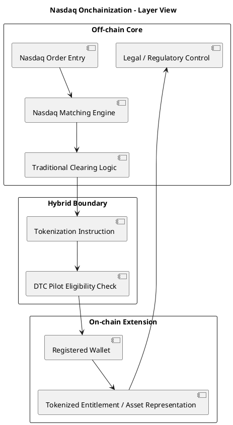

# 나스닥 토큰화 증권의 온체인화 딥다이브

## 문서 목적

이 문서는 2026년 3월 기준 공개 자료를 바탕으로, 나스닥 토큰화 증권 구조를 `온체인화`라는 관점에서 다시 해부한 메모다. 초점은 세 가지다.

1. 현재 구조에서 `어디가 온체인화되고 어디는 아닌지`
2. `현재 나스닥 구조`와 `완전 온체인 증권시장`의 차이
3. 향후 `T+0`, `담보화`, `DeFi 연결`이 어디까지 가능할지

결론부터 말하면, 지금의 나스닥 구조는 `온체인 시장`이라기보다 `오프체인 시장 위에 온체인 자산 표현과 사후처리 레이어를 붙인 하이브리드 모델`이다.

## 1. 한눈에 보는 핵심 판단

- `거래`는 대부분 여전히 오프체인이다.
- `토큰 형태의 보유 표현`은 부분적으로 온체인화된다.
- `법적 권리와 규제 질서`는 여전히 기존 증권 인프라가 중심이다.
- 따라서 현재 구조를 `완전 온체인 증권거래소`로 부르기는 어렵다.
- 다만 제도권이 처음으로 `온체인 자산 표현`을 공식 증권시장 구조 안에 넣었다는 점은 매우 큰 변화다.

## 2. 레이어별로 보면 무엇이 온체인이고 무엇이 아닌가

전문가 관점에서는 시스템을 레이어별로 나눠봐야 혼동이 적다.

| 레이어 | 현재 상태 | 해설 |
| --- | --- | --- |
| 주문 입력 | 대체로 오프체인 | 나스닥 회원사가 기존 주문 시스템으로 주문을 넣고, 토큰화 선호 플래그를 붙임 |
| 매칭 엔진 | 오프체인 | 기존 나스닥 주문장과 price-time priority 유지 |
| 체결 | 오프체인 | 체결 자체는 전통적 시장 구조 안에서 발생 |
| 청산 지시 | 오프체인 중심 | 체결 후 토큰화 선호가 DTC 쪽 사후처리로 전달 |
| 자산 표현 | 부분 온체인 | 조건 충족 시 토큰 형태 entitlement 또는 디지털 보유 표현 반영 |
| 권리 처리 | 대부분 오프체인 중심 | 배당, 의결권, 기업행동은 기존 법체계 및 인프라와 정합 필요 |
| 최종 법적 통제 | 오프체인 중심 | DTC와 기존 증권법 체계가 최종 기준점 역할 |

즉, 현재 단계의 본질은 `trading on-chain`이 아니라 `post-trade token representation`에 가깝다.

## 3. 현재 구조에서 실제로 온체인화되는 부분

현재 공개 구조를 가장 정확하게 표현하면 `자산 표현과 사후 인도 단계의 온체인화`다.

### 3.1 토큰 형태의 보유 표현

체결이 끝난 뒤, DTC 파일럿 조건을 만족하면 특정 보유분이 블록체인 기반 디지털 표현으로 반영될 수 있다. 이때 중요한 것은 `토큰이 별도 자산으로 독립하는 것이 아니라 기존 증권의 다른 표현 방식`이라는 점이다.

### 3.2 지갑 기반 보유 구조 일부 도입

기존 증권사 계좌/중앙예탁 기록만으로 끝나는 것이 아니라, 파일럿 참여자에게는 등록된 지갑 주소가 들어간다. 다만 이는 퍼블릭 체인 자유지갑 개념이라기보다 `허가형 등록 지갑`에 가깝다.

### 3.3 향후 프로그래머블 권리처리의 발판

온체인화의 장기적 의미는 단순 보유 증명에만 있지 않다. 배당, 의결권, 기업행동, 투자자 참여를 더 자동화할 수 있는 가능성이 열린다는 데 있다. 다만 2026년 기준으로는 `가능성의 개시`이지 `완성된 실행`은 아니다.

## 4. 현재 구조에서 아직 온체인화되지 않은 부분

오해가 가장 많은 영역이다. 지금은 `블록체인 위에서 주식이 거래된다`고 단순화하면 과장이다.

### 4.1 주문장과 가격형성

주문이 퍼블릭 체인 스마트컨트랙트에서 모이고, 체결이 블록 생성과 함께 확정되는 구조가 아니다. 기존 나스닥 시장의 주문장과 매칭 엔진이 계속 중심이다.

### 4.2 현금과 증권의 원자적 동시결제

완전한 온체인 DvP라면 현금 토큰과 증권 토큰이 하나의 원자적 트랜잭션 안에서 동시에 교환돼야 한다. 그러나 현재 공개 구조는 여전히 T+1 기반 전통 결제 질서를 상당 부분 유지한다.

### 4.3 법적 원장의 완전 이전

퍼블릭 블록체인이 곧 법적 원장 그 자체가 되는 단계는 아니다. 현재는 DTC와 기존 규제 질서가 `진짜 기준점`이고, 블록체인은 그 위에 붙는 확장 레이어다.

### 4.4 자유로운 퍼블릭 체인 상호운용

참여자가 마음대로 체인을 선택하고, 아무 지갑이나 쓰고, 디파이 프로토콜로 바로 이동하는 구조가 아니다. 초기 구조는 명확하게 `permissioned` 성격이 강하다.

## 5. 현재 나스닥 구조 vs 완전 온체인 증권시장

아래 비교가 가장 중요하다.

| 항목 | 현재 나스닥/DTC 구조 | 완전 온체인 증권시장 |
| --- | --- | --- |
| 주문장 | 중앙화 거래소 주문장 | 온체인 오더북 또는 AMM/하이브리드 구조 |
| 매칭 | 나스닥 매칭 엔진 | 스마트컨트랙트 또는 온체인/오프체인 혼합 매칭 |
| 결제 주기 | T+1 중심, 토큰화는 사후 단계 | T+0 또는 근실시간 결제 |
| 증권 표현 | 기존 증권의 토큰 표현 | 발행부터 네이티브 온체인 증권 |
| 현금 레그 | 전통 현금 결제 인프라 의존 | 스테이블코인/CBDC/토큰화 예금 기반 가능 |
| 투자자 접근 | 기관 및 허가형 참여자 중심 | 규제 설계에 따라 더 직접적 접근 가능 |
| 법적 기준점 | DTC와 기존 증권법 | 온체인 원장 자체의 법적 인정 필요 |
| 기업행동 처리 | 기존 시스템과 정합 필요 | 스마트컨트랙트 자동화 가능하나 법적 설계 필요 |
| 거래 시간 | 전통 시장 시간 중심 | 24/7 확장 가능 |

이 비교가 보여주는 핵심은, 현재 나스닥 구조는 `시장 자체를 온체인으로 옮긴 것`이 아니라 `시장 인프라 일부를 온체인 친화적으로 바꾸기 시작한 것`이라는 점이다.

## 6. 왜 이렇게 점진적 구조를 택했는가

기술만 보면 더 급진적인 구조도 가능하다. 그러나 제도권 시장은 가격형성, 감시, 청산, 결제, 투자자 보호, 기업행동 처리까지 모두 연결되어 있기 때문에 급진적 전환 비용이 매우 크다.

점진적 구조의 장점은 다음과 같다.

- 기존 시장 유동성을 쪼개지 않음
- 기존 감시 체계와 규정 준수 로직을 유지 가능
- 시스템 실패 시 traditional settlement로 fallback 가능
- 기관 투자자와 수탁기관이 기존 운영 모델을 크게 바꾸지 않아도 됨
- 온체인화의 효율성을 부분적으로 시험할 수 있음

즉, 지금 구조는 `기술 최대화`보다 `제도 마찰 최소화`를 우선한 설계다.

## 7. 향후 T+0는 어떻게 가능한가

T+0는 단순히 블록체인을 붙인다고 자동으로 되는 것이 아니다. 핵심은 `증권 토큰`만이 아니라 `현금 레그`도 디지털 방식으로 즉시 결제 가능해야 한다는 점이다.

### 7.1 현재 막혀 있는 이유

- 현금 결제가 여전히 전통 인프라에 크게 의존함
- 청산기관과 수탁기관의 리스크 통제 로직이 T+1 구조에 맞춰져 있음
- 결제 실패, 담보 부족, 시장 충격 전파를 어떻게 다룰지 제도 설계가 필요함

### 7.2 T+0로 가기 위한 조건

- 토큰화 증권과 `디지털 현금`의 동시 결제 구조 확보
- 법적으로 인정되는 스테이블코인, 토큰화 예금, 또는 CBDC 활용 가능성 확대
- 실시간 담보 관리 및 유동성 공급 장치 필요
- 예외 상황에서 거래 취소, 정정, 제재를 어떻게 처리할지 규칙 마련

### 7.3 실무 해석

따라서 향후 T+0는 `토큰화 주식` 자체보다 `디지털 캐시 레일`의 발전 속도에 더 크게 좌우될 가능성이 높다.

## 8. 담보화는 왜 중요한가

제도권에서 온체인화의 경제적 가치는 단순 보유 편의보다 `담보 이동성`에서 더 크게 나타날 수 있다.

### 8.1 의미

토큰화된 증권이 빠르게 이동 가능하고 표준화된 방식으로 검증된다면, 이를 repo, 대출, 마진, 파생상품 증거금 같은 영역에서 담보로 쓰기 쉬워진다.

### 8.2 현재 제약

- 파일럿 단계에서는 토큰 보유분의 담보가치 인정이 매우 보수적일 수 있음
- 중앙기관 리스크 관리 체계와 디파이형 담보 로직 사이에 큰 간극이 존재
- 토큰이 담보로 사용될 때 법적 집행 가능성과 우선순위 문제를 정리해야 함

### 8.3 장기 의미

만약 이 부분이 열리면, 증권의 온체인화는 단순 거래 혁신보다 `자본 효율성 혁신`으로 이어질 수 있다. 이것이 제도권 기관들이 토큰화에 관심을 가지는 더 큰 이유일 수 있다.

## 9. DeFi 연결 가능성은 어디까지인가

이 질문은 가장 흥미롭지만, 동시에 가장 많은 오해가 생기는 지점이다.

### 9.1 가능한 시나리오

- 토큰화 증권을 온체인 담보로 활용
- 토큰화 증권을 기반으로 대출·유동성 프로토콜과 연결
- 글로벌 투자자가 시간 제약 없이 디지털 방식으로 접근

### 9.2 당장 어려운 이유

- 증권법상 규제 준수 로직을 디파이 구조에 내장하기 어려움
- permissioned 보유 구조와 permissionless 유동성 풀 사이 충돌이 큼
- 투자자 적격성, 이전 제한, KYC/AML 요건을 유지해야 함
- 잘못 설계하면 `같은 자산, 같은 권리` 원칙이 훼손될 수 있음

### 9.3 현실적 해석

가까운 미래에는 `완전 개방형 DeFi 편입`보다 `준허가형 온체인 금융`이 먼저 발전할 가능성이 높다. 즉, 제도권이 받아들일 수 있는 규제 내장형 프로토콜, 화이트리스트 지갑, 제한된 이전성 구조가 더 현실적이다.

## 10. 온체인화의 진짜 병목은 기술보다 법과 운영

겉으로 보면 블록체인 기술이 핵심처럼 보이지만, 실제 병목은 다음 영역이다.

- 누가 법적 소유자로 인정되는가
- 주주명부와 온체인 잔고를 어떻게 정합시키는가
- 배당과 의결권을 어떻게 자동화하면서도 법적 효력을 보장하는가
- 사고 발생 시 누구에게 어떤 책임이 있는가
- 국경 간 거래에서 어느 관할 규칙을 따르는가

즉, 주식의 온체인화는 `기술 프로젝트`라기보다 `시장제도 재설계 프로젝트`에 가깝다.

## 11. 단계별 로드맵 가설

### 11.1 1단계: 토큰 표현 도입

- 기존 시장 구조 유지
- 제한된 종목과 참여자만 허용
- 사후처리 중심 토큰화

### 11.2 2단계: 권리처리 자동화 확대

- 배당, 의결권, 기업행동 일부 자동화
- 등록 지갑 기반 투자자 커뮤니케이션 고도화

### 11.3 3단계: 디지털 캐시 연계

- 스테이블코인, 토큰화 예금, CBDC 등과 연결
- 실질적 T+0 또는 near-instant DvP 실험 가능

### 11.4 4단계: 담보 이동성과 시장시간 확장

- 토큰화 증권의 담보 활용 확대
- 24/7에 가까운 시장 운영 또는 확장 세션 설계 가능

### 11.5 5단계: 부분적 제도권-DeFi 접점 형성

- 허가형 온체인 자본시장 프로토콜 등장
- 기존 중앙기관과 온체인 프로토콜의 역할 분담 재설계

## 12. 구조 다이어그램

## 13. 전문가 관점 핵심 요약

첫째, 현재 나스닥 구조의 온체인화는 `거래 엔진의 온체인화`가 아니라 `사후처리와 자산 표현의 온체인화`다.

둘째, 완전 온체인 증권시장과 비교하면, 아직 핵심 요소인 `원자적 결제`, `디지털 캐시 레그`, `24/7 시장`, `네이티브 온체인 법적 원장`이 빠져 있다.

셋째, 그럼에도 불구하고 이번 구조는 중요하다. 왜냐하면 제도권이 처음으로 `같은 증권, 같은 권리, 다른 표현 방식`이라는 원칙 아래 블록체인을 공식 시장 인프라에 편입하기 시작했기 때문이다.

넷째, 향후 승부처는 기술 데모가 아니라 `T+0`, `담보 인정`, `권리처리 자동화`, `규제 내장형 온체인 금융`이 실제로 열리느냐에 달려 있다.

## 참고 메모

- SEC Release No. 34-105047, March 18, 2026
- Reuters, March 19, 2026, Nasdaq tokenized securities coverage
- Finadium, March 19, 2026, DTC pilot and tokenized settlement analysis
- Ledger Insights, March 2026, post-trade tokenization and T+1 commentary
- 공개 업계 해설 자료를 교차 참고해 구조적 공통점 중심으로 정리
