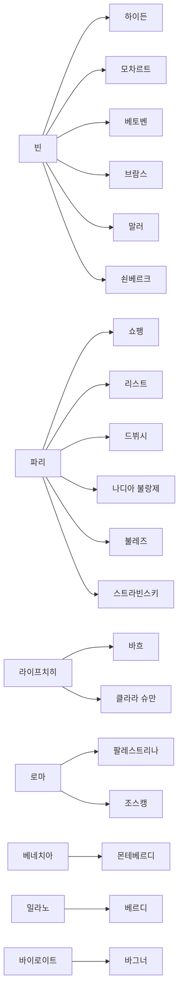

# Relationship Diagram Cities

## 목적

- 도시를 중심 노드로 두고 어떤 인물과 제도가 집중되는지 빠르게 파악한다.

## Mermaid 초안

## 사용 메모

- 한 도시의 인물군을 읽을 때 `cities/*.md`와 `people/*.md`를 함께 연다.
- 도시 간 이동이 중요한 인물은 두 도시에 중복 연결해도 된다.
