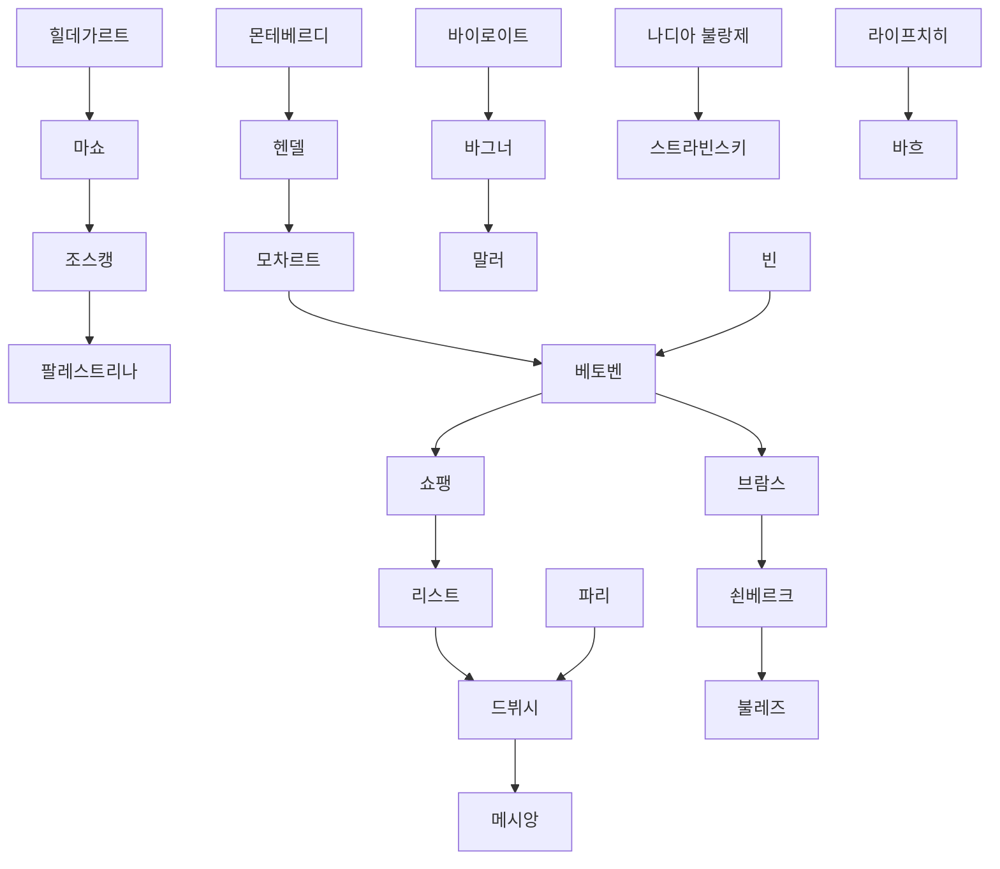

# Relationship Diagram Compact

## 목적

- 인물당 핵심 연결선 2-3개만 남겨 전체 구조를 빠르게 훑을 수 있는 축약판을 만든다.

## Mermaid 초안

```mermaid
graph TD
  Hildegard[힐데가르트] --> Machaut[마쇼]
  Machaut --> Josquin[조스캥]
  Josquin --> Palestrina[팔레스트리나]

  Monteverdi[몬테베르디] --> Handel[헨델]
  Handel --> Mozart[모차르트]
  Mozart --> Beethoven[베토벤]

  Beethoven --> Chopin[쇼팽]
  Chopin --> Liszt[리스트]
  Liszt --> Debussy[드뷔시]

  Beethoven --> Brahms[브람스]
  Brahms --> Schoenberg[쇤베르크]
  Schoenberg --> Boulez[불레즈]

  Debussy --> Messiaen[메시앙]
  Wagner[바그너] --> Mahler[말러]
  Nadia[나디아 불랑제] --> Stravinsky[스트라빈스키]

  Vienna[빈] --> Beethoven
  Paris[파리] --> Debussy
  Leipzig[라이프치히] --> Bach[바흐]
  Bayreuth[바이로이트] --> Wagner
```

## 사용 메모

- 발표용, 개요용, 첫 진입용으로 적합하다.
- 세부 연구 단계에서는 `relationship-diagram.md`와 함께 본다.
