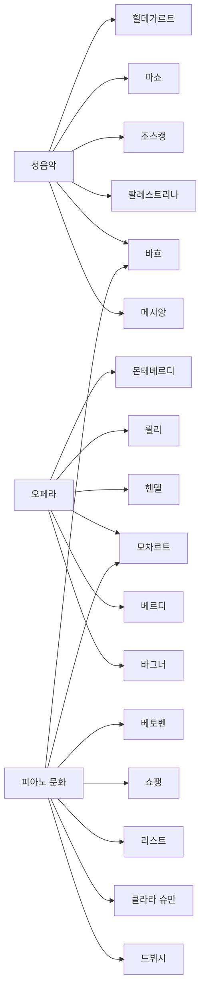

# Relationship Diagram Genres

## 목적

- 장르를 중심 노드로 두고 인물군이 어떤 축으로 연결되는지 빠르게 본다.

## Mermaid 초안

```mermaid
graph LR
  Sacred[성음악] --> Hildegard[힐데가르트]
  Sacred --> Machaut[마쇼]
  Sacred --> Josquin[조스캥]
  Sacred --> Palestrina[팔레스트리나]
  Sacred --> Bach[바흐]
  Sacred --> Messiaen[메시앙]

  Opera[오페라] --> Monteverdi[몬테베르디]
  Opera --> Lully[륄리]
  Opera --> Handel[헨델]
  Opera --> Mozart[모차르트]
  Opera --> Verdi[베르디]
  Opera --> Wagner[바그너]

  Piano[피아노 문화] --> Bach
  Piano --> Mozart
  Piano --> Beethoven[베토벤]
  Piano --> Chopin[쇼팽]
  Piano --> Liszt[리스트]
  Piano --> Clara[클라라 슈만]
  Piano --> Debussy[드뷔시]
```

## 사용 메모

- 인물이 여러 장르에 걸치더라도, 출발 장르를 하나 먼저 정하고 읽기 시작한다.
- 장르 문서와 도시 문서를 같이 보면 제도 차이가 더 잘 드러난다.
