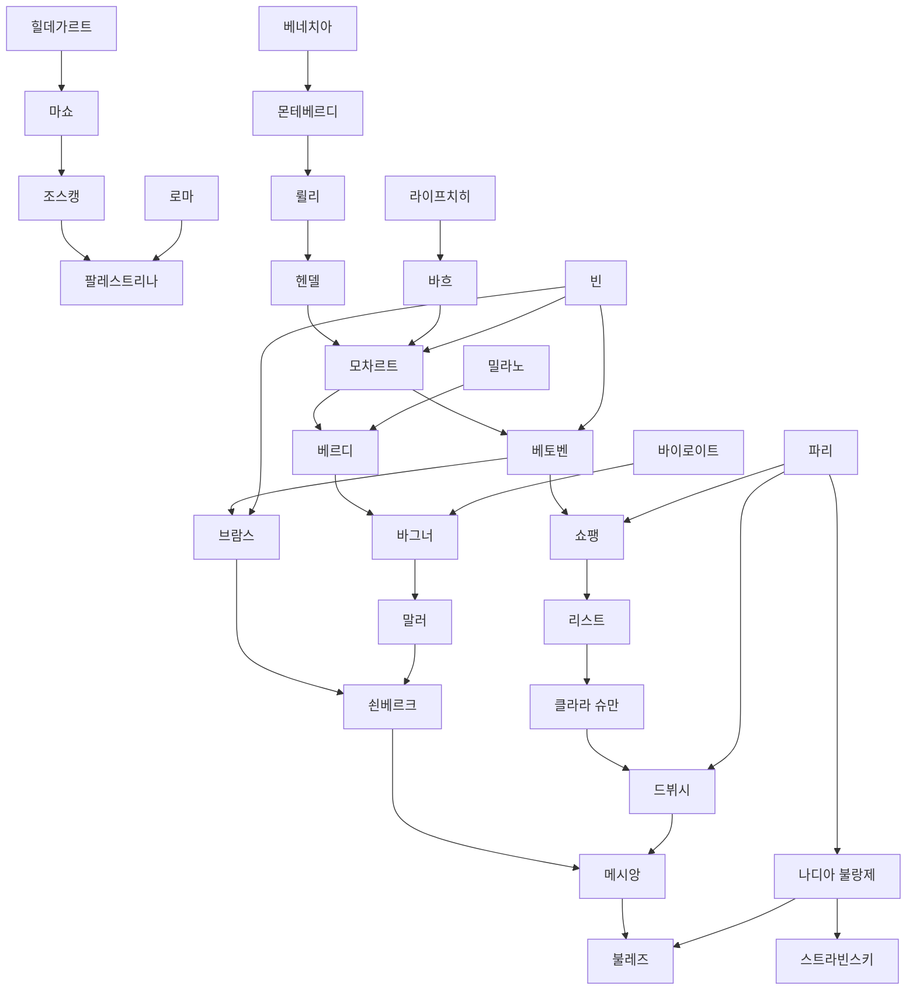

# Relationship Diagram

## 목적

- `influence-map.md`의 내용을 다이어그램으로 옮기기 쉬운 텍스트 형식으로 정리한다.
- 나중에 Mermaid, Excalidraw, Obsidian Canvas 같은 도구로 옮길 때 바로 활용할 수 있게 한다.

## Mermaid 초안

## 노드 분류 기준

- 인물 노드: 작곡가, 연주자, 교육자, 이론가
- 도시 노드: 활동 허브, 제도 허브, 재발견 허브
- 관계선: 영향, 전승, 후원, 재발견

## 다음 확장

1. 관계선에 색을 넣어 영향, 전승, 후원, 재발견을 구분한다.
2. 도시 노드를 따로 묶어 지리 허브 다이어그램을 만든다.
3. 인물별로 직접 연결선 3개 이상만 남긴 축약판도 만든다.
