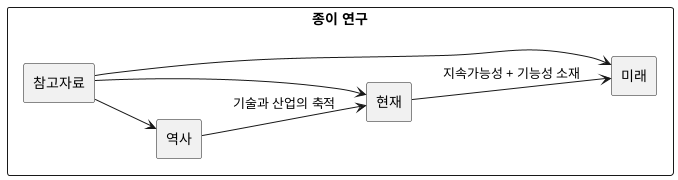

# 종이의 역사, 현재, 미래 개요

## 이 연구의 목적

이 폴더는 종이를 단순한 기록 매체가 아니라 인류의 지식 저장 기술, 산업 재료, 순환경제 자원, 차세대 기능성 소재로 함께 바라보기 위한 연구 노트다. 핵심 질문은 세 가지다.

1. 종이는 어떻게 발명되고 세계로 확산되었는가?
2. 디지털 시대에도 종이는 왜 여전히 중요한가?
3. 종이는 앞으로 사라질 매체인가, 아니면 다른 형태로 재탄생할 소재인가?

## 핵심 관점

- 역사 관점: 종이는 문명 간 지식 이동을 가속한 매체였다.
- 산업 관점: 종이는 수공업에서 대량 생산 체계로 전환되며 근대 행정, 출판, 교육을 지탱했다.
- 현재 관점: 인쇄용지는 줄어들지만 포장재, 위생용지, 산업용 특수지 수요는 여전히 크다.
- 환경 관점: 종이는 재생 가능성과 재활용 가능성 때문에 플라스틱 대체재로 주목받지만, 물 사용량, 에너지, 화학 코팅, 산림 관리 문제도 함께 봐야 한다.
- 미래 관점: 종이는 기능성 셀룰로오스 기반 소재, 센서 기판, 스마트 패키징, 바이오 기반 전자소자로 확장되고 있다.

## 문서 읽기 순서

- `01_종이의_역사적_발전.md`: 발명, 전파, 제지 기술의 장기 변화
- `02_종이의_현재_용도와_기술.md`: 현재 종이 산업, 용도, 제조와 재활용 구조
- `03_종이의_미래_전망과_대안.md`: 미래 기술, 대체재, 사회적 역할 변화
- `04_종이_연구_참고자료_및_링크.md`: 참고할 기관, 자료 유형, 링크 정리
- `05_추가로_연구할_영역.md`: 전체 연구를 더 깊게 확장할 주제와 질문
- `06_한국_제지산업_통계_정리.md`: 한국 산업 구조를 수치 중심으로 읽는 보조 문서
- `07_한지와_와시_선지_비교.md`: 동아시아 전통 종이 비교 심화 문서
- `08_발표용_요약.md`: 발표와 요약 전달을 위한 압축 문서

## 연구 방향성

### 1. 종이를 "사라지는 매체"로만 보지 않는다

디지털 전환 이후 종이가 줄어든 영역은 분명하지만, 종이의 전체 역할이 축소만 된 것은 아니다. 인쇄와 기록에서 감소가 일어난 대신, 전자상거래 포장, 식품 포장, 위생재, 의료·센서용 종이, 친환경 패키징 같은 영역은 오히려 중요성이 커졌다.

### 2. "종이"와 "셀룰로오스 기반 소재"를 연결해서 본다

미래 연구에서는 전통적인 종이와 더불어 나노셀룰로오스, 기능성 코팅지, 종이 기반 전자소자, 생분해성 패키징 필름을 함께 다뤄야 한다. 종이는 완성된 전통 산업이 아니라, 바이오 기반 소재 플랫폼으로 재해석되고 있다.

### 3. 지속가능성은 장점과 한계를 동시에 기록한다

종이는 플라스틱보다 친환경적이라는 단순 도식으로 설명하기 어렵다. 재활용 인프라, 섬유 반복 사용 한계, PFAS 같은 코팅 문제, 운송과 에너지 비용, 산림 인증 체계까지 함께 봐야 더 정확하다.

## 연구 질문

- 채륜은 정말 "종이의 발명자"인가, 아니면 제지법의 제도화 인물인가?
- 중국에서 이슬람권, 유럽으로 이어진 제지 기술의 이동은 어떤 지식 네트워크를 만들었는가?
- 한반도와 동아시아의 종이 문화, 특히 한지는 세계 제지사에서 어떤 독자성을 가지는가?
- 산업혁명 이후 종이의 대량 생산은 교육, 출판, 관료제 확대와 어떻게 연결되는가?
- 오늘날 종이 산업에서 가장 성장하는 분야는 무엇인가?
- 한국 제지 산업은 디지털 전환과 전자상거래 확대 속에서 어떤 구조 재편을 겪고 있는가?
- 재활용 가능한 종이와 실제로 순환되는 종이 사이에는 어떤 차이가 있는가?
- 종이는 미래에 디지털을 대체하는가, 아니면 디지털과 결합하는가?

## 초기 판단

- 종이는 과거의 매체이면서 동시에 미래의 소재다.
- 종이의 미래는 "책과 문서"보다 "포장, 센서, 기능성 기판, 바이오 재료"에서 더 크게 열릴 가능성이 높다.
- 따라서 이 연구는 문화사, 기술사, 산업사, 환경정책, 재료과학을 함께 보는 다층적 접근이 유효하다.

## 문서 구조 다이어그램

## 다음 확장 후보

- 국가별 제지 산업 비교
- 종이와 책 문화의 역사
- 종이 포장재와 플라스틱 대체 정책 비교
- 나노셀룰로오스와 종이 전자소자 기술 동향

## 이번 보강에서 확인한 추가 방향

- 한국 맥락은 단순 보조 사례가 아니라 독립 축으로 다룰 가치가 있다. 전통 한지, 현대 제지 산업, 재활용 정책, 포장재 전환이 한 연구 안에서 이어진다.
- 발표나 강의용으로 확장하려면 연표와 대표 사례를 계속 누적하는 방식이 효과적이다.
- 향후에는 보존과학, 독서문화, 교육 매체, LCA 비교까지 연결하면 종이를 더 입체적으로 설명할 수 있다.
