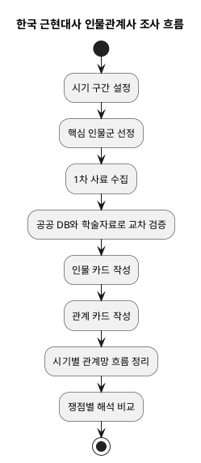

# 한국 근현대사 인물관계사 조사 개요

## 이 조사의 목표

- 한국 근현대사를 사건 중심 요약이 아니라 인물 중심, 관계 중심으로 다시 읽는다.
- 한 인물의 단독 생애가 아니라 스승과 제자, 동지와 경쟁자, 조직과 국가, 망명지와 국내 네트워크가 어떻게 역사의 흐름을 만들었는지 추적한다.
- 인물의 평가를 서둘러 확정하기보다, 서로 다른 성격의 자료를 교차 검증해 관계와 사건의 변화를 입체적으로 정리한다.

## 왜 인물 관계 중심으로 보는가

- 같은 사건도 누가 누구와 연결되어 있었는지에 따라 의미가 달라진다.
- 한국 근현대사는 개화, 식민지 지배, 독립운동, 해방 정국, 전쟁, 권위주의, 민주화, 산업화처럼 거대한 전환이 연속되는데, 이 흐름은 제도만으로는 설명되지 않고 사람들의 연대와 갈등을 함께 봐야 선명해진다.
- 인물 관계망을 중심에 두면 사건의 전후 맥락, 사상의 이동, 조직의 분화와 재편, 지역과 해외 거점의 연결이 함께 드러난다.

## 조사 기본 원칙

### 1. 출처 우선순위

1. 1차 사료: 공문서, 판결문, 편지, 일기, 신문, 잡지, 명부, 사진, 구술 채록 원문
2. 공공기관 데이터베이스: 국가기관 또는 공공기관이 구축한 역사 자료 서비스
3. 학술 연구: KCI 등재 학술지 논문, 연구서, 학위논문
4. 검증된 백과류: 한국민족문화대백과사전 등
5. 대중 서술 자료: 해설서, 전시 콘텐츠, 기사형 요약 자료

### 2. 교차 검증 규칙

- 핵심 사실은 최소 2개 이상의 서로 다른 계열 출처로 확인한다.
- 논쟁적 해석은 하나의 결론으로 단정하지 않고 해석의 차이를 분리해 적는다.
- 인물 평가와 사실 서술을 분리한다.
- 관계 정보는 가능한 한 "언제", "어떤 계기", "어떤 문서나 사건에서 확인되는지"까지 함께 기록한다.
- 회고록과 구술 자료는 매우 유용하지만 기억 왜곡 가능성을 전제로 반드시 다른 자료와 대조한다.

### 3. 기록 방식

- 모든 문서는 Markdown으로 작성한다.
- 모든 문서명은 `00_`, `01_`처럼 번호 접두사를 붙인다.
- 각 문서에는 최소한 `핵심 질문`, `확인된 사실`, `해석 쟁점`, `출처`, `추가 조사 필요` 항목을 둔다.
- 인용 시에는 가능한 한 기관명, 자료명, URL, 검색일을 남긴다.

## 우선 활용할 핵심 출처 묶음

### 국가·공공기관 자료

- 국사편찬위원회 `한국사데이터베이스`: 근현대 인물자료, 신문, 잡지, 단체 자료, 독립운동 자료, 관보, 판결 관련 자료를 폭넓게 교차 확인하는 기본 축
- 국가기록원: 행정 문서, 판결문, 인사 자료, 사진 및 영상 등 국가와 개인의 접점을 확인하는 데 유용
- 독립기념관 `한국독립운동정보시스템`: 독립운동 인물, 관련 단체, 사건, 판결 자료, 해외 네트워크 추적에 강점
- 공공데이터포털 개방 자료: 독립운동 관련 수형인명부, 인명사전 편찬 기본정보 등 구조화된 데이터 확인에 유용

### 학술·참고 자료

- 한국학중앙연구원 `한국민족문화대백과사전`: 인물과 사건의 기본 서술 및 참고문헌 파악용
- KCI, RISS: 특정 인물군, 조직, 사상 흐름, 지역 네트워크에 대한 최신 연구 동향 확인용
- 필요 시 관련 학회지와 단행본 서지 추가 정리

### 보완 자료

- 구술 자료와 회고 자료: 공식 기록에 남지 않는 감정선, 비공식 관계, 내부 갈등 파악용
- 전시/기념관 자료: 주제 입문에는 좋지만, 단독 근거로 쓰지 않고 반드시 상위 출처와 대조

## 조사 진행 방식

### 1단계. 범위 설정

- 시기를 우선 1870년대 후반부터 1990년대 초반까지 넓게 잡고, 실제 작성에서는 전환점 중심으로 나눈다.
- 전환점 예시: 개화기, 대한제국기, 의병과 계몽운동, 일제강점기, 3.1운동과 임시정부, 사회주의/민족주의 계열 분화, 해방 정국, 한국전쟁, 4.19, 5.16 이후, 유신, 민주화운동

### 2단계. 인물군 선정

- 정치가만이 아니라 사상가, 언론인, 교육가, 종교인, 독립운동가, 관료, 군인, 노동·학생운동 주체까지 포함한다.
- 처음에는 시대별 핵심 인물군을 작게 뽑고, 관계를 따라 주변 인물을 확장한다.
- 한 인물을 고정된 영웅이나 악인으로 보기보다 시기별 위치 변화와 관계 변화에 주목한다.

### 3단계. 관계 유형 정의

- 협력 관계: 공동 조직, 공동 선언, 공동 투쟁, 공동 정부 참여
- 갈등 관계: 노선 차이, 권력 경쟁, 배신, 숙청, 결별
- 매개 관계: 소개자, 후원자, 번역자, 자금 연결자, 해외 거점 연결자
- 제도 관계: 국가, 정당, 학교, 종교기관, 군, 언론사, 비밀결사와의 연결
- 지역 관계: 서울, 평양, 만주, 연해주, 상하이, 도쿄, 미국 등 이동 경로와 거점

### 4단계. 문서화 순서

1. 개요 문서 작성
2. 시대 구간별 핵심 질문 정리
3. 인물 카드 작성
4. 인물 간 관계 문서 작성
5. 관계를 시간축에 얹어 흐름 문서 작성
6. 쟁점별 비교 문서 작성

## 추천 문서 로드맵

- `00_개요.md`: 전체 방향, 원칙, 조사 절차, 문서 체계
- `01_시기구분과_핵심질문.md`: 시대 구간과 각 구간의 질문 정의
- `02_인물선정기준.md`: 어떤 인물을 우선 포함할지 기준 정리
- `03_관계유형분류.md`: 협력, 갈등, 매개, 조직, 지역 관계 분류 틀
- `04_출처정리와_검증기준.md`: 출처 등급, 인용 방식, 충돌 자료 처리 원칙
- `05_우선조사_핵심인물군.md`: 첫 조사 대상 인물군 제안
- `06_작성서식_인물카드.md`: 인물별 정리 템플릿
- `07_작성서식_관계카드.md`: 관계별 정리 템플릿
- `08_작성서식_시기흐름표.md`: 시기별 흐름 정리 템플릿

## 처음부터 이렇게 시작하면 좋다

### 시작 묶음 A: 개화와 대한제국 전환기

- 흥선대원군, 고종, 명성황후, 김옥균, 박영효, 서재필, 유길준, 안중근
- 질문: 개혁과 보수, 자주와 외세 의존, 왕권과 관료, 망명과 귀환의 관계가 어떻게 얽혔는가

### 시작 묶음 B: 독립운동 네트워크

- 안창호, 이승만, 김구, 여운형, 신채호, 박은식, 김원봉, 홍범도, 김좌진
- 질문: 임시정부, 무장투쟁, 외교론, 실력양성론, 사회주의 계열의 협력과 갈등은 어떻게 전개되었는가

### 시작 묶음 C: 해방 이후 국가 건설과 분단

- 이승만, 김구, 여운형, 박헌영, 김규식, 장면, 박정희
- 질문: 해방 직후 연합과 분열, 좌우협력의 실패, 국가 수립 과정의 배제와 선택은 무엇이었는가

### 시작 묶음 D: 민주화와 국가 재편

- 조봉암, 장준하, 김대중, 김영삼, 전태일, 함석헌, 박종철, 이한열
- 질문: 권위주의 체제와 민주화 네트워크는 어떤 연결과 희생 위에서 형성되었는가

## 정리 단위의 예시

- 인물 문서 1건에는 생애 전체보다 "관계가 드러나는 핵심 국면"을 우선 정리한다.
- 관계 문서 1건에는 두 사람 또는 한 조직과 한 인물의 연결을 다룬다.
- 흐름 문서 1건에는 특정 시기 안에서 관계망이 어떻게 재편되었는지 적는다.

## 향후 작성할 때 계속 확인할 질문

- 이 인물은 누구와 연결될 때 역사적 의미가 커지는가
- 이 관계는 언제 시작되었고, 무엇 때문에 바뀌었는가
- 같은 사건을 다른 진영의 자료는 어떻게 다르게 서술하는가
- 이 인물의 영향력은 공식 직위에서 나왔는가, 비공식 네트워크에서 나왔는가
- 국내와 해외 거점의 연결은 어떤 방식으로 작동했는가

## 조사 흐름도

## 현재 단계에서의 결론

- 이 조사는 단순 연표 정리가 아니라 "인물", "관계", "시기 흐름", "출처 검증" 네 축으로 진행하는 것이 가장 안정적이다.
- 처음부터 모든 인물을 다 다루기보다, 시대 전환점별 핵심 인물군을 먼저 잡고 관계를 따라 확장하는 방식이 효율적이다.
- 앞으로의 문서는 개요에서 출발해 인물 카드, 관계 카드, 시기 흐름표 순으로 점차 세분화하는 구조가 적절하다.

## 출처 메모

- 국사편찬위원회 `한국사데이터베이스` https://db.history.go.kr/
- 국사편찬위원회 `기관 홈페이지` https://www.history.go.kr/
- 독립기념관 `한국독립운동정보시스템` https://search.i815.or.kr/
- 한국학중앙연구원 `한국민족문화대백과사전` https://encykorea.aks.ac.kr/
- 공공데이터포털 `국가기록원 독립운동관련 수형인명부 콘텐츠 DB`
- 공공데이터포털 `독립기념관 인명사전편찬 기본정보`
- KCI `한국근현대사연구` 및 관련 학술지 검색
- RISS 학술연구정보서비스
